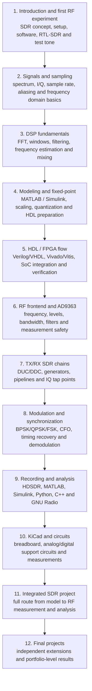

# Course Structure

## Overall logic

The course is structured as an engineering route: from understanding signals and SDR architecture to reproducible experiments, FPGA implementation and a final project.

## Learning levels

| Level | Focus | Engineering result |
|---|---|---|
| Signal theory | signals, spectrum, sampling, I/Q | student understands what is measured |
| Modeling | MATLAB / Simulink reference | expected behavior is defined |
| Implementation | fixed-point, HDL, FPGA | model is mapped to hardware |
| RF measurement | AD9363, RTL-SDR, levels | physical signal is validated |
| Analysis | IQ replay, FFT, EVM, BER | experiment becomes reproducible |
| Project | full system integration | portfolio-level result |

## Blocks

### Block 1 — Introduction and first reception
Defines the setup, introduces HDSDR/RTL-SDR and performs the first RF experiment.

### Block 2 — Signals and sampling
Explains spectrum, complex representation and aliasing with practical examples.

### Block 3 — DSP basics
Covers FFT, filtering and frequency estimation as SDR building blocks.

### Block 4 — Simulink and fixed-point
Transforms floating-point models into hardware-ready representations.

### Block 5 — FPGA / HDL flow
Introduces HDL, FPGA pipelines and SoC integration.

### Block 6 — RF frontend
Connects digital samples to RF hardware behavior and measurement constraints.

### Block 7 — TX/RX chains
Builds full SDR transmit and receive chains.

### Block 8 — Modulation and synchronization
Adds digital modulation and recovery algorithms.

### Block 9 — Recording and analysis
Standardizes IQ recording and multi-tool analysis.

### Block 10 — KiCad and circuits
Introduces circuit design as part of SDR experiments.

### Block 11 — Integrated project
Combines all layers into a full SDR system.

### Block 12 — Final projects
Defines independent project paths.

## Recommended cadence

1. Theory and engineering context
2. Demonstration
3. Lab with measurements
4. Analysis and conclusions
5. Short reproducible report
