# Структура курса

## Общая логика

Курс построен как инженерный маршрут: от понимания сигнала и SDR-архитектуры до воспроизводимого эксперимента, FPGA-реализации и итогового проекта.

```mermaid
flowchart TB
    B1["1. Введение и первый RF-эксперимент<br/>SDR-идея, стенд, ПО, RTL-SDR, HDSDR и первый тестовый тон"]
    B2["2. Сигналы и дискретизация<br/>спектр, I/Q, частота дискретизации, aliasing и базовая частотная картина"]
    B3["3. DSP-основа<br/>FFT, окна, фильтрация, оценка частоты и цифровой перенос"]
    B4["4. Модель и fixed-point<br/>MATLAB / Simulink, масштабирование, квантование и подготовка к HDL"]
    B5["5. HDL / FPGA flow<br/>Verilog/VHDL, Vivado/Vitis, SoC-интеграция и верификация"]
    B6["6. RF frontend и AD9363<br/>частота, уровень, полоса, фильтры, согласование и безопасные измерения"]
    B7["7. TX/RX тракты SDR<br/>DUC/DDC, генераторы, конвейер обработки и точки записи IQ"]
    B8["8. Модуляция и синхронизация<br/>BPSK/QPSK/FSK, CFO, timing recovery и демодуляция"]
    B9["9. Запись и анализ<br/>HDSDR, MATLAB, Simulink, Python, C++, GNU Radio и отчёты"]
    B10["10. KiCad и схемотехника<br/>макетная плата, аналоговые/цифровые узлы и поддержка экспериментов"]
    B11["11. Интегрированный SDR-проект<br/>полный маршрут от модели до платы, RF-измерения и анализа"]
    B12["12. Итоговые проекты<br/>самостоятельные варианты развития курса и портфолио-результат"]

    B1 --> B2 --> B3 --> B4 --> B5 --> B6 --> B7 --> B8 --> B9 --> B10 --> B11 --> B12
```

## Учебные уровни

| Уровень | Что изучается | Инженерный результат |
|---|---|---|
| Signal theory | сигнал, спектр, дискретизация, I/Q | студент понимает, что именно измеряет |
| Modeling | MATLAB / Simulink, reference vectors | появляется эталон поведения |
| Implementation | fixed-point, HDL, FPGA, SoC | модель переносится в железо |
| RF measurement | AD9363, RTL-SDR, HDSDR, уровни | физический сигнал проверяется внешне |
| Analysis | IQ replay, FFT, EVM, BER, отчёт | эксперимент становится воспроизводимым |
| Project | интеграция всех слоёв | результат можно показывать как инженерное портфолио |

## Блоки курса

### Блок 1 — Введение в SDR и первый приём
Задаёт рабочий стенд, вводит HDSDR/RTL-SDR, показывает первый тестовый тон и формирует базовую дисциплину измерений.

### Блок 2 — Сигналы и дискретизация
Объясняет спектр, комплексное представление, частоту дискретизации и aliasing на практических примерах.

### Блок 3 — Основы DSP
Разбирает FFT, окна, фильтрацию, оценку частоты и цифровой перенос как базу для SDR-цепочек.

### Блок 4 — Simulink и fixed-point
Переводит алгоритмы из floating-point модели в аппаратно-ориентированную fixed-point форму.

### Блок 5 — FPGA / HDL flow
Показывает путь к HDL, FPGA-конвейеру, SoC-интеграции и верификации.

### Блок 6 — Радиотракт и AD9363
Связывает цифровые отсчёты с реальным RF frontend: частоты, уровни, фильтры, полоса и безопасность.

### Блок 7 — TX/RX тракты
Собирает передающий и приёмный тракт: DUC/DDC, генераторы, фильтры и точки контроля.

### Блок 8 — Модуляция и синхронизация
Добавляет BPSK/QPSK/FSK, восстановление частоты и времени, демодуляцию и анализ созвездий.

### Блок 9 — Инструменты записи и анализа
Стандартизирует запись IQ и повторный анализ в MATLAB, Simulink, Python, C++, GNU Radio.

### Блок 10 — KiCad и базовая электроника
Добавляет схемотехнический слой: макетная плата, простые генераторы, вспомогательные узлы.

### Блок 11 — Интегрированный SDR-проект
Собирает все уровни в один воспроизводимый эксперимент от модели до RF-измерений.

### Блок 12 — Итоговые проекты
Даёт варианты самостоятельной проектной работы и портфолио-результатов.

## Рекомендуемый ритм

1. Теория и постановка инженерной задачи.
2. Демонстрация на модели или стенде.
3. Лабораторная работа с фиксацией параметров.
4. Анализ IQ/графиков и выводы.
5. Короткий отчёт с воспроизводимыми результатами.
