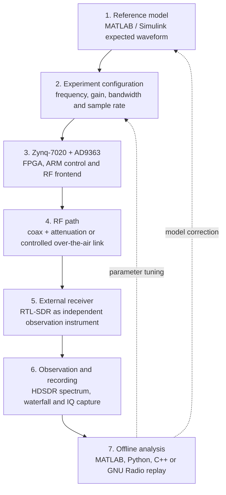

# Zynq SDR Course / Курс SDR на Zynq

[](#)
[](mkdocs.yml)
[](https://github.com/Lay007/zynq-sdr-course/actions/workflows/full_course_smoke.yml)
[](https://github.com/Lay007/zynq-sdr-course/actions/workflows/block5_hdl.yml)
[](https://github.com/Lay007/zynq-sdr-course/actions/workflows/block8_sync.yml)
[](https://github.com/Lay007/zynq-sdr-course/actions/workflows/block9_recording_analysis.yml)
[](LICENSE)

A **bilingual engineering course on Software-Defined Radio** that connects signal theory, DSP, fixed-point modeling, HDL/FPGA flow, RF frontend understanding, TX/RX chains, synchronization, IQ recording, practical electronics and final engineering reports.

Это **двуязычный инженерный курс по SDR**, который связывает теорию сигналов, DSP, fixed-point моделирование, HDL/FPGA flow, радиотракт, TX/RX цепочки, синхронизацию, запись IQ, практическую электронику и итоговые инженерные отчёты.


---

## Start here in 10 minutes / Быстрый старт за 10 минут

```bash
git clone https://github.com/Lay007/zynq-sdr-course.git
cd zynq-sdr-course
python -m pip install -r requirements.txt
make docs
make labs
```

For the full local smoke check, install Icarus Verilog (`iverilog`) and run:

```bash
make smoke
```

Для полной локальной проверки установите Icarus Verilog (`iverilog`) и выполните:

```bash
make smoke
```

Useful commands:

| Command | Purpose |
|---|---|
| `make install` | install Python dependencies |
| `make docs` | strict MkDocs build |
| `make serve` | local MkDocs preview |
| `make labs` | run representative executable Python labs |
| `make hdl` | run Block 5 Verilog smoke tests |
| `make smoke` | run docs + labs + HDL checks |
| `make clean` | remove generated local build artifacts |

---

## Fast navigation / Быстрая навигация

| Page | Why open it |
|---|---|
| [Course demo dashboard](docs/demo-dashboard.md) | fast visual overview of executable course artifacts |
| [Visual course map](docs/course-map.md) | complete engineering route from theory to final project |
| [Portfolio view](docs/portfolio-view.md) | what this repository demonstrates professionally |
| [Model → FPGA → RF → Measurement](docs/model-to-measurement.md) | core system-level route |
| [Real data policy](docs/real-data-policy.md) | how to store and describe real IQ captures |
| [Reproducibility guide](docs/reproducibility-guide.md) | how to reproduce generated results |

---

## What this course teaches / Чему учит курс

| Layer | Engineering result |
|---|---|
| **Signals and spectra** | sampling, bandwidth, aliasing, modulation basics |
| **DSP modeling** | FFT, FIR, mixing, decimation, reference plots |
| **Fixed-point DSP** | word length, scaling, quantization, implementation error |
| **HDL / FPGA** | Verilog blocks, streaming DSP, latency, testbenches |
| **Zynq + AD9363 hardware** | RF configuration, board-level signal generation and capture |
| **TX/RX chains** | DUC/DDC, frequency plans, loopback metrics |
| **Synchronization** | CFO, phase, timing recovery, EVM and BER |
| **IQ recording** | CI16/CU8/CF32 readers, metadata and capture quality checks |
| **Electronics / KiCad** | attenuators, RC filters, RF safety and schematic discipline |
| **Integrated project** | requirements, architecture, measurement report and portfolio output |

---

## Why this repository matters / Почему этот репозиторий важен

This repository is not just a collection of markdown notes. It is structured as a **teaching, implementation and verification path** from first SDR concepts to measurement-oriented project work.

Этот репозиторий — не просто набор markdown-файлов. Он оформлен как **учебный, инженерный и верифицируемый маршрут** от первых понятий SDR до проектной работы с измерениями.

The course is designed around a complete engineering chain:

```text
theory -> modeling -> fixed-point -> HDL/FPGA -> RF frontend -> TX/RX -> synchronization -> IQ recording -> electronics -> integrated project
```

```text
теория -> моделирование -> fixed-point -> HDL/FPGA -> радиотракт -> TX/RX -> синхронизация -> запись IQ -> электроника -> интегрированный проект
```

---

## Reproducibility / Воспроизводимость

Representative executable labs can be launched with one command:

```bash
python tools/run_all_labs.py
```

The script creates:

```text
docs/assets/course_reproducibility_summary.json
docs/assets/course_reproducibility_summary.md
```

The full smoke workflow checks:

- MkDocs strict build;
- representative Python labs;
- Block 5 Verilog testbenches;
- generated summary artifacts.

---

## Generated demo plots / Автоматические демо-графики

Auto-generated IEEE-style plots are produced by GitHub Actions and stored in `docs/assets`.

Графики в IEEE-style автоматически генерируются через GitHub Actions и сохраняются в `docs/assets`.

| Lab | Demo plot | Engineering meaning |
|---|---|---|
| Lab 1 | Tone FFT | Peak frequency and noise floor |
| Lab 2 | AM vs FM spectrum | Modulation bandwidth comparison |
| Lab 3 | QPSK constellation | IQ quality and phase/noise effects |
| Lab 4 | Synchronization impact | CFO correction effect |
| Lab 5 | EVM vs impairments | Quantitative impairment comparison |
| Lab 6 | BER performance | End-to-end receiver quality |

### Lab 1 — Tone FFT


### Lab 2 — AM vs FM Spectrum


### Lab 3 — QPSK Constellation


### Lab 4 — Synchronization Impact


### Lab 5 — EVM vs Impairments


### Lab 6 — BER Performance


---

## Hardware baseline / Аппаратная база

The current hands-on setup includes an external receiver and a board-level SDR platform for practical experiments.

Текущая практическая аппаратная база включает внешний приёмник и SDR-платформу на уровне платы для лабораторных работ и экспериментов.

### RTL-SDR V3 Pro


### Xilinx Zynq-7020 + ADR9363


---

## SDR stand flow / Поток SDR-стенда



**Practical flow:** generate a signal on the Zynq/AD9363 platform → receive it with RTL-SDR → observe it in HDSDR → record IQ samples → analyze the recording in multiple software environments.

**Практический поток:** сформировать сигнал на платформе Zynq/AD9363 → принять его через RTL-SDR → наблюдать в HDSDR → записать IQ-данные → проанализировать запись в нескольких программных средах.

---

## Course blocks / Блоки курса

1. `blocks/block_01_intro_sdr`
2. `blocks/block_02_signals_and_sampling`
3. `blocks/block_03_dsp_basics`
4. `blocks/block_04_simulink_and_fixed_point`
5. `blocks/block_05_fpga_hdl_flow`
6. `blocks/block_06_rf_frontend_and_ad9363`
7. `blocks/block_07_tx_rx_chains`
8. `blocks/block_08_modulation_and_synchronization`
9. `blocks/block_09_recording_and_analysis_tools`
10. `blocks/block_10_kicad_and_basic_electronics`
11. `blocks/block_11_integrated_sdr_project`
12. `blocks/block_12_final_projects`

---

## Templates / Шаблоны

Reusable templates are stored in `templates/`:

```text
templates/capture_metadata.template.json
templates/lab_report.template.md
templates/final_project_report.template.md
templates/rf_safety_checklist.template.md
```

---

## License / Лицензия

MIT License
