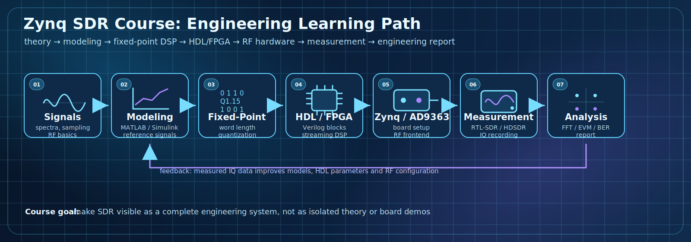
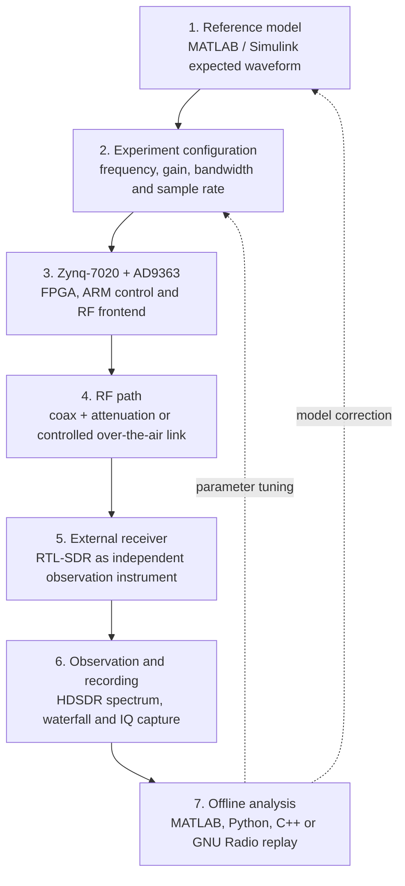
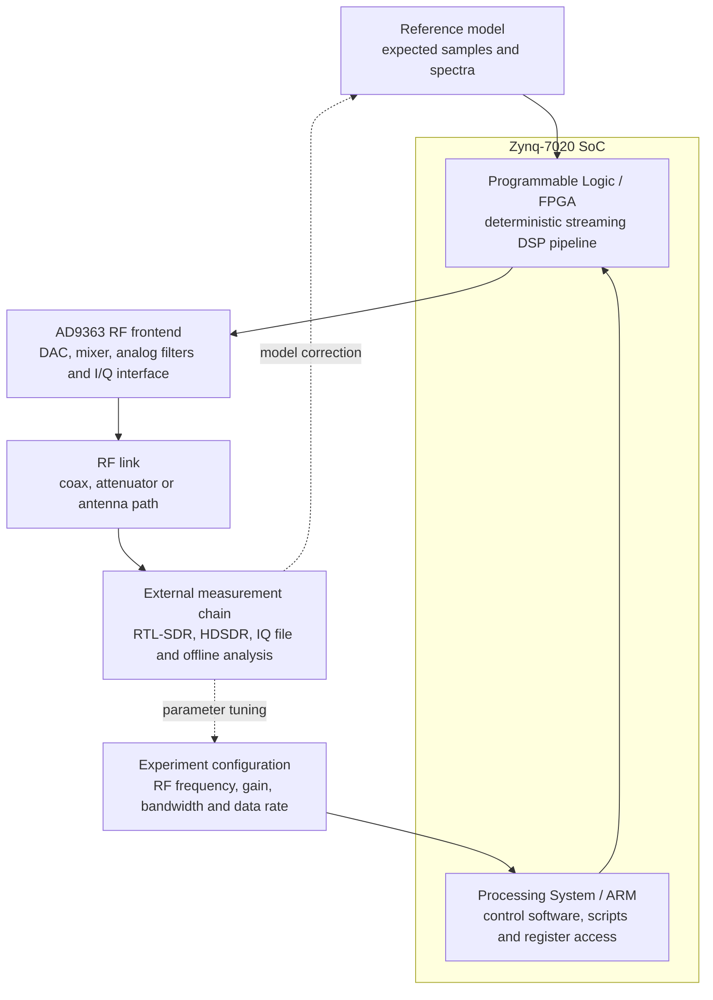
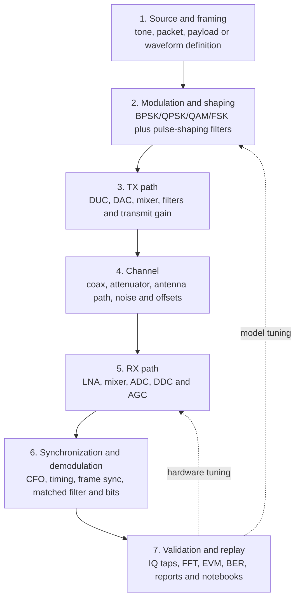

# Zynq SDR Course / Курс SDR на Zynq

A **bilingual engineering course on SDR** that connects signal theory, DSP, fixed-point modeling, HDL/FPGA flow, RF front-end understanding, board-level experiments, measurements, and engineering reports.

Это **двуязычный инженерный курс по SDR**, который связывает теорию сигналов, DSP, fixed-point моделирование, HDL/FPGA flow, понимание радиотракта, практическую работу с платой, измерения и инженерные отчёты.

## What this course teaches / Чему учит курс

| Layer | Engineering result |
|---|---|
| **Signals and spectra** | sampling, bandwidth, aliasing, modulation basics |
| **MATLAB / Simulink modeling** | reference waveforms, plots, repeatable experiments |
| **Fixed-point DSP** | word length, scaling, quantization, implementation error |
| **HDL / FPGA** | Verilog blocks, streaming DSP, latency, testbenches |
| **Zynq + AD9363 hardware** | RF configuration, board-level signal generation and capture |
| **External measurement** | RTL-SDR, HDSDR, IQ recording, independent observation |
| **Analysis and reports** | FFT, EVM, BER, SNR, engineering conclusions |

## Quick navigation / Быстрая навигация

- [Русская версия / Russian version](README_ru.md)
- [English version / Английская версия](README_en.md)
- [IEEE-style guide](docs/ieee_style_guide.md)
- [GitHub demo notes](docs/demo_readme.md)
- [Course blocks](#course-blocks--блоки-курса)
- [Hardware baseline](#hardware-baseline--аппаратная-база)
- [Generated demo plots](#generated-demo-plots--автоматические-демо-графики)

---

## Why this repository matters / Почему этот репозиторий важен

This repository is not just a collection of markdown notes. It is structured as a **teaching and implementation path** from first SDR concepts to hardware-oriented project work.

Этот репозиторий — не просто набор markdown-файлов. Он оформлен как **учебный и инженерный маршрут** от первых понятий SDR до проектной работы, ориентированной на железо.

The course is designed around a complete engineering chain:

Курс построен вокруг полной инженерной цепочки:

**theory → modeling → fixed-point → HDL / FPGA → SDR board → external reception → IQ recording → analysis → circuit design → final project**

**теория → моделирование → fixed-point → HDL / FPGA → SDR-плата → внешний приём → запись IQ → анализ → схемотехника → итоговый проект**

---

## Generated demo plots / Автоматические демо-графики

Auto-generated IEEE-style plots are produced by GitHub Actions from `tools/generate_ieee_plots.py` and stored in `docs/assets`.

Графики в IEEE-style автоматически генерируются через GitHub Actions из `tools/generate_ieee_plots.py` и сохраняются в `docs/assets`.

| Lab | Demo plot | Engineering meaning |
|---|---|---|
| Lab 1 | Tone FFT | Peak frequency and noise floor |
| Lab 2 | AM vs FM spectrum | Modulation bandwidth comparison |
| Lab 3 | QPSK constellation | IQ quality and phase/noise effects |
| Lab 4 | Synchronization impact | CFO correction effect |
| Lab 5 | EVM vs impairments | Quantitative impairment comparison |
| Lab 6 | BER performance | End-to-end receiver quality |

### Lab 1 — Tone FFT

### Lab 2 — AM vs FM Spectrum

### Lab 3 — QPSK Constellation

### Lab 4 — Synchronization Impact

### Lab 5 — EVM vs Impairments

### Lab 6 — BER Performance

---

## Current state / Текущее состояние

- **Block 1 is populated in bilingual form** / **Блок 1 наполнен в двуязычном формате**
- **IEEE-style plot generation is automated through GitHub Actions** / **Генерация IEEE-style графиков автоматизирована через GitHub Actions**
- **MkDocs deployment is temporarily manual** / **Деплой MkDocs временно переведён в ручной режим**
- **Visual landing pipeline is available** / **Добавлена наглядная карта инженерного маршрута**

---

## Hardware baseline / Аппаратная база

The current hands-on setup already includes a simple external receiver and a board-level SDR platform for practical experiments.

Текущая практическая аппаратная база уже включает простой внешний приёмник и SDR-платформу на уровне платы для лабораторных работ и экспериментов.

### RTL-SDR V3 Pro

### Xilinx Zynq-7020 + ADR9363

---

## SDR stand flow / Поток SDR-стенда

**Practical flow:** generate a signal on the Zynq/ADRV platform → receive it with RTL-SDR → observe it in HDSDR → record IQ samples → analyze the recording in multiple software environments.

**Практический поток:** сформировать сигнал на платформе Zynq/ADRV → принять его через RTL-SDR → наблюдать в HDSDR → записать IQ-данные → проанализировать запись в нескольких программных средах.

## Level 2: Zynq / FPGA signal path / Уровень 2: тракт Zynq / FPGA

## Level 3: SDR TX/RX processing chain / Уровень 3: TX/RX тракт SDR

## Course blocks / Блоки курса

1. `blocks/block_01_intro_sdr`
2. `blocks/block_02_signals_and_sampling`
3. `blocks/block_03_dsp_basics`
4. `blocks/block_04_simulink_and_fixed_point`
5. `blocks/block_05_fpga_hdl_flow`
6. `blocks/block_06_rf_frontend_and_ad9363`
7. `blocks/block_07_tx_rx_chains`
8. `blocks/block_08_modulation_and_synchronization`
9. `blocks/block_09_recording_and_analysis_tools`

## License / Лицензия

MIT License
