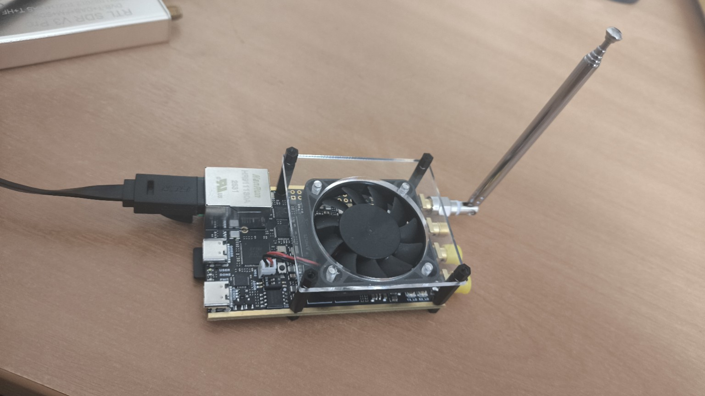
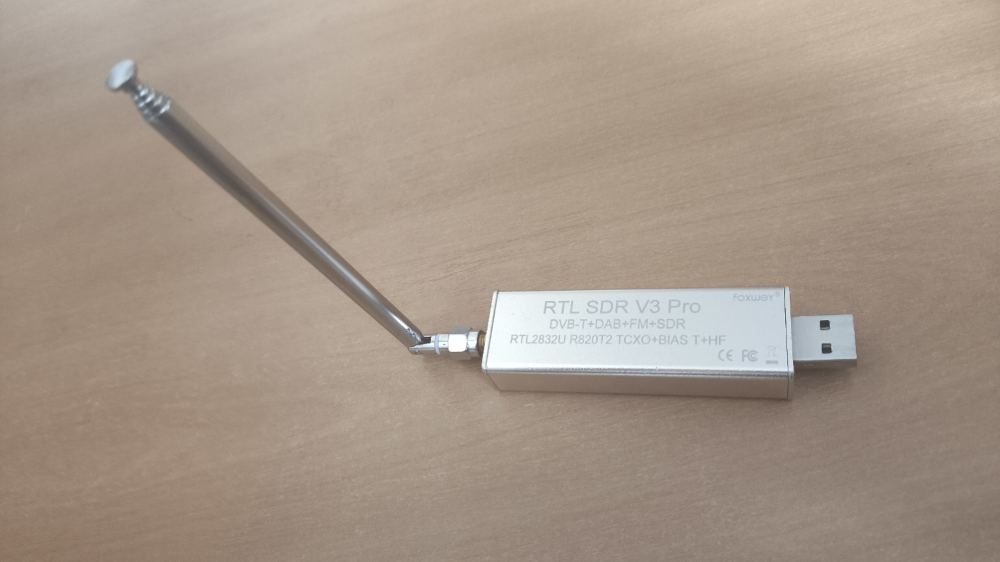

# Zynq SDR Course / Курс SDR на Zynq

A **bilingual engineering course on SDR** that connects signal theory, DSP, fixed-point modeling, FPGA flow, RF front-end understanding, and board-level implementation.

Это **двуязычный инженерный курс по SDR**, который связывает теорию сигналов, DSP, fixed-point моделирование, FPGA flow, понимание радиотракта и практическую реализацию на плате.

## Navigation / Навигация

- [Русская версия / Russian version](README_ru.md)
- [English version / Английская версия](README_en.md)

## Why this repository matters / Почему этот репозиторий важен

This repository is not just a collection of markdown notes. It is structured as a **teaching and implementation path** from first SDR concepts to hardware-oriented project work.

Этот репозиторий — не просто набор markdown-файлов. Он оформлен как **учебный и инженерный маршрут** от первых понятий SDR до проектной работы, ориентированной на железо.

It is designed for learners and practitioners who want to move through a coherent chain:

Он рассчитан на тех, кто хочет пройти связную цепочку:

**theory → modeling → fixed-point → HDL / FPGA → SDR board → external reception → IQ recording → analysis → circuit design → final project**

**теория → моделирование → fixed-point → HDL / FPGA → SDR-плата → внешний приём → запись IQ → анализ → схемотехника → итоговый проект**

## Course website / Сайт курса

The repository already includes an **MkDocs Material** site configuration and a **GitHub Pages deployment workflow**.

В репозитории уже есть конфигурация сайта на **MkDocs Material** и workflow для публикации через **GitHub Pages**.

Configured site URL / Настроенный адрес сайта:

- `https://lay007.github.io/zynq-sdr-course/`

## Current state / Текущее состояние

- **Block 1 is fully populated in bilingual form** / **Блок 1 полностью наполнен в двуязычном формате**
- **The remaining blocks already have structured bilingual scaffolds** / **Остальные блоки уже имеют структурированные двуязычные каркасы**
- **The repository is ready for iterative course development and site publication** / **Репозиторий готов к поэтапному развитию курса и публикации в виде сайта**

## Hardware baseline / Аппаратная база

The current hands-on setup already includes a simple external receiver and a board-level SDR platform for practical experiments.

Текущая практическая аппаратная база уже включает простой внешний приёмник и SDR-платформу на уровне платы для лабораторных работ и экспериментов.

### RTL-SDR V3 Pro

### Xilinx Zynq-7020 + ADR9363

### SDR stand flow / Поток SDR-стенда

| Step | Block | Role | Output |
|---:|---|---|---|
| 1 | **Model & Control** | Simulink / HDL / software setup | Parameters and generated samples |
| ↓ |  | **configure / generate** |  |
| 2 | **Zynq-7020 + ADRV** | FPGA / SoC processing and RF TX/RX path | RF signal |
| ↓ |  | **RF over air or cable** |  |
| 3 | **RTL-SDR** | External receiver for first signal capture | Received sample stream |
| ↓ |  | **observe** |  |
| 4 | **HDSDR** | Spectrum and waterfall visualization | Visible signal and tuned recording setup |
| ↓ |  | **store** |  |
| 5 | **IQ Recording** | Captured IQ sample file | IQ dataset |
| ↓ |  | **analyze** |  |
| 6 | **Offline Analysis** | MATLAB / Simulink / Python / C++ / GNU Radio | Plots, metrics, reports, conclusions |

**Practical flow:** generate a signal on the Zynq/ADRV platform → receive it with RTL-SDR → observe it in HDSDR → record IQ samples → analyze the recording in multiple software environments.

**Практический поток:** сформировать сигнал на платформе Zynq/ADRV → принять его через RTL-SDR → наблюдать в HDSDR → записать IQ-данные → проанализировать запись в нескольких программных средах.

## Course blocks / Блоки курса

1. `blocks/block-1`
2. `blocks/block-2`
3. `blocks/block-3`
4. `blocks/block-4`
5. `blocks/block-5`
6. `blocks/block-6`
7. `blocks/block-7`
8. `blocks/block-8`
9. `blocks/block-9`
10. `blocks/block-10`
11. `blocks/block-11`
12. `blocks/block-12`

## License / Лицензия

MIT License
