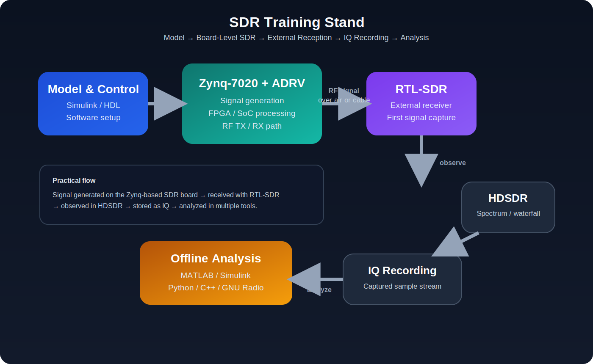

# Курс SDR на Zynq: от теории к реализации на плате

Это **двуязычный инженерный курс по SDR**, построенный как последовательный маршрут от теории сигналов до практической реализации на SDR-платформе на базе Zynq.

Курс задуман не как разрозненный набор заметок, а как цельная учебная траектория, которая связывает:

- теорию сигналов;
- основы SDR;
- базовый DSP;
- моделирование в Simulink и fixed-point подготовку;
- HDL / FPGA flow;
- понимание радиотракта;
- инструменты записи и анализа;
- базовую электронику и KiCad;
- интегрированные итоговые проекты.

## Назначение

Репозиторий рассчитан на тех, кто хочет выйти за рамки отдельных SDR-экспериментов и пройти более полный инженерный маршрут:

**теория → модель → fixed-point → HDL / FPGA → SDR-плата → внешний приём → запись IQ → анализ → схемотехника → итоговый проект**

## Что входит в репозиторий

- корневой `README.md` как двуязычная landing page;
- `README_ru.md` и `README_en.md` для навигации по языкам;
- `COURSE_STRUCTURE_ru.md` и `COURSE_STRUCTURE_en.md`;
- `LAB_TRACK_ru.md` и `LAB_TRACK_en.md`;
- `MEDIA_GUIDE_ru.md` и `MEDIA_GUIDE_en.md`;
- папка `blocks/` со всеми модулями курса;
- **полностью наполненный блок 1**;
- двуязычные каркасы для остальных блоков.

## Веб-версия курса

В репозитории уже есть конфигурация сайта на **MkDocs Material** и workflow публикации через **GitHub Pages**.

Настроенный адрес сайта:

- `https://lay007.github.io/zynq-sdr-course/`

## Аппаратная база

Текущая практическая аппаратная база уже включает простой внешний приёмник и SDR-платформу на уровне платы для лабораторных работ и экспериментов.

### RTL-SDR V3 Pro

RTL-SDR используется как доступный внешний приёмник для первых задач по приёму, записи и наблюдению сигнала.

### Плата Xilinx Zynq-7020 + модуль ADRV

Эта фотография показывает реальную SDR-платформу на уровне платы, которая используется в практической аппаратно-ориентированной части курса.

### Диаграмма SDR-стенда

## Навигация

- [Двуязычная landing page](README.md)
- [Структура курса](COURSE_STRUCTURE_ru.md)
- [Лабораторный трек](LAB_TRACK_ru.md)
- [Руководство по фото, схемам и анимации](MEDIA_GUIDE_ru.md)
- [Английская версия](README_en.md)

## Блоки курса

1. `block_01_intro_sdr` — введение, инструменты и первый приём сигнала
2. `block_02_signals_and_sampling` — сигналы, спектр, дискретизация, IQ
3. `block_03_dsp_basics` — FFT, фильтрация, окна и базовые DSP-операции
4. `block_04_simulink_and_fixed_point` — моделирование, fixed-point и подготовка к железу
5. `block_05_fpga_hdl_flow` — маршрут Simulink, HDL, Vivado и SoC
6. `block_06_rf_frontend_and_ad9363` — радиотракт, уровни, частоты и AD9363
7. `block_07_tx_rx_chains` — тракты передачи и приёма, DUC и DDC
8. `block_08_modulation_and_synchronization` — модуляция, демодуляция и синхронизация
9. `block_09_recording_and_analysis_tools` — HDSDR, GNU Radio, MATLAB, Python и C++
10. `block_10_kicad_and_basic_electronics` — KiCad, макетная плата и вспомогательные узлы
11. `block_11_integrated_sdr_project` — интегрированный учебный SDR-проект
12. `block_12_final_projects` — итоговые проектные работы

## Текущее состояние

- **Блок 1 уже полностью наполнен в двуязычном формате**
- **Остальные блоки подготовлены как сильные двуязычные каркасы**
- **Репозиторий готов к поэтапному развитию и публикации в виде сайта курса**

## Почему этот репозиторий сильный

- курс подан в параллельном двуязычном формате, а не как смешанные заметки;
- в нём явно проведён мостик от теории к реализации;
- он объединяет DSP, моделирование, FPGA flow, понимание радиотракта, анализ записей и базовую электронику;
- его удобно читать и как GitHub-репозиторий, и как сайт документации.

## Рекомендуемые следующие шаги

- последовательно наполнять блоки 2–12 в том же стиле;
- добавить больше диаграмм, фото плат и схем в аппаратно-ориентированные разделы;
- расширить лабораторные работы IQ-записями, наборами данных и скриптами анализа;
- усиливать end-to-end линию интегрированного практического проекта.

## Лицензия

Проект распространяется по лицензии MIT. Подробности см. в файле [LICENSE](LICENSE).
