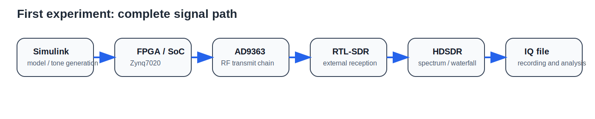

# MEDIA GUIDE — How to Add Photos, Schematics, and Animation

## Recommended folder structure
```text
images/
├── photos/
├── screenshots/
├── diagrams/
├── schematics/
└── animations/
```

## What to store in `photos/`
Real photos of equipment and the lab setup.

Examples:
- `board_zynq7020_top.jpg`
- `rtl_sdr_receiver.jpg`
- `lab_setup_overview.jpg`

## What to store in `screenshots/`
Screenshots of software windows:
- HDSDR
- MATLAB
- Simulink
- GNU Radio
- KiCad

Preferred format: **PNG**

## What to store in `diagrams/`
Block diagrams, architecture figures, and connection diagrams.

Preferred format: **SVG**
Fallback format: **PNG**

## What to store in `schematics/`
Exported schematic images intended for insertion into Markdown.

Preferred formats:
- **SVG**
- **PNG**

KiCad source files should be stored separately in the `kicad/` folder.

## What to store in `animations/`
Short GIF animations or short video clips that show:
- appearance of the tone in HDSDR;
- frequency shift of the tone;
- amplitude change;
- connection sequence of the lab setup.

For GitHub and Markdown, **GIF** is convenient.
For a future website or GitHub Pages, **MP4/WebM** is preferable.

## Naming convention
Use:
- lowercase names;
- English words;
- underscore as a separator.

Examples:
- `hdsdr_tone_spectrum.png`
- `block01_signal_chain_en.svg`
- `tone_frequency_change.gif`

## Practical recommendations
- use **JPG** for photos;
- use **PNG** for screenshots and software windows;
- use **SVG** for diagrams and exported schematics whenever possible;
- keep GIF animations short and lightweight;
- do not mix photos, screenshots, and diagrams in one folder.

## What is recommended for Block 1
### Photos
- SDR board photo
- RTL-SDR photo
- overall setup photo
- cable connection example
- over-the-air setup example

### Screenshots
- HDSDR tone spectrum
- HDSDR waterfall
- MATLAB FFT result
- Simulink model
- GNU Radio flowgraph
- KiCad schematic view

### Diagrams
- SDR architecture
- training setup structure
- model → board → reception → analysis route

### Animations
- one GIF with tone appearance in HDSDR
- one GIF with tone frequency change

## Example insertion in Markdown
```markdown



```
