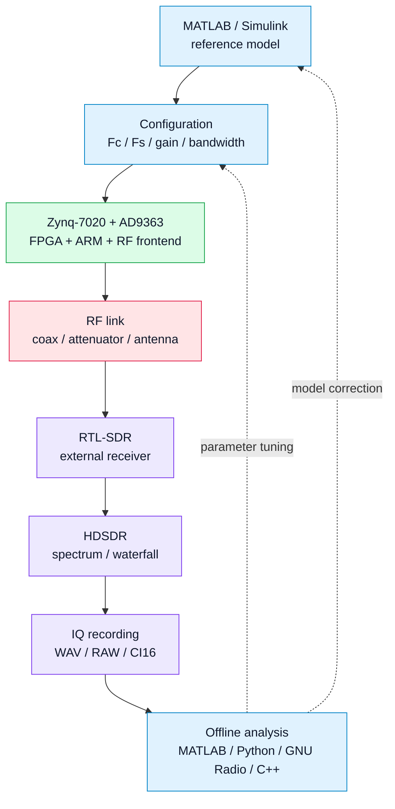

# 03. Hardware Platform of the Course

## Purpose of the section

This section introduces the practical SDR stand used in the course and explains how each hardware element contributes to the full engineering chain:

**model → FPGA / RF frontend → external receiver → IQ recording → offline analysis**

## 1. Hardware baseline

The first block uses a compact but realistic SDR setup:

- **Zynq-7020 + AD9363** SDR board;
- **RTL-SDR** external receiver;
- PC for modeling, observation, recording and analysis;
- cable or over-the-air RF link;
- attenuators, adapters and matching elements when required.

## 2. RTL-SDR V3 Pro

The RTL-SDR receiver is used as an external observation instrument. It allows students to verify that the transmitted signal exists outside the main SDR board and can be received by an independent device.

**Role in the course:**

- first signal detection;
- HDSDR spectrum and waterfall observation;
- IQ recording for offline analysis;
- practical demonstration of receiver gain, noise and overload.

## 3. Xilinx Zynq-7020 + AD9363 board

This is the main board-level SDR platform of the course. It connects digital signal processing with a real RF frontend.

**Zynq-7020 provides:**

- ARM processing system for control and configuration;
- FPGA programmable logic for deterministic streaming DSP;
- a practical bridge between software models and hardware implementation.

**AD9363 provides:**

- RF transmit and receive chains;
- DAC/ADC conversion;
- analog filtering and frequency translation;
- I/Q stream interface with the digital processing path.

## 4. SDR stand flow

## 5. Connection options

### Over-the-air setup

Advantages:

- intuitive demonstration;
- quick setup;
- close to real RF operation.

Limitations:

- external interference;
- lower repeatability;
- stronger dependence on antenna placement and environment.

### Cable setup

Advantages:

- repeatable measurements;
- controlled channel;
- easier comparison between experiments.

Limitations:

- attenuation is mandatory;
- direct uncontrolled TX-to-RX connection is unsafe;
- input-level limits must be respected.

## 6. Signal-level discipline

Never connect a transmitter directly to a receiver without understanding signal levels.

Always consider:

- maximum safe input level;
- attenuation;
- cable losses;
- receiver gain;
- clipping and overload symptoms.

## 7. Pre-lab checklist

Before starting the first lab, verify that:

- the SDR board is powered correctly;
- RTL-SDR is recognized by the PC;
- the selected RF link is safe;
- HDSDR can display receiver spectrum;
- IQ recording path is prepared;
- experiment parameters are documented.

## 8. Engineering takeaway

The hardware stand is intentionally simple at the first stage, but it already contains the complete SDR engineering loop:

**generate → transmit → receive → observe → record → analyze → improve**

This is the foundation for later blocks on modulation, synchronization, fixed-point implementation, FPGA processing and RF measurements.
