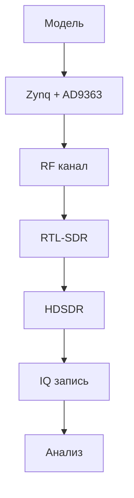

# 03. Аппаратная база курса

## Назначение раздела

Этот раздел показывает реальный SDR-стенд и связывает его с инженерной цепочкой курса:

**модель → FPGA / RF тракт → внешний приём → запись IQ → анализ**

## 1. Аппаратная база

В первом блоке используется компактный, но полноценный SDR-стенд:

- SDR-плата **Zynq-7020 + AD9363**
- внешний приёмник **RTL-SDR**
- ПК для моделирования, наблюдения и анализа
- кабель или эфирный канал
- аттенюаторы и переходники

## 2. RTL-SDR V3 Pro

RTL-SDR используется как внешний измерительный инструмент для визуализации сигнала.

## 3. Плата Zynq-7020 + AD9363

Это основная SDR-платформа курса, связывающая цифровую обработку и реальный радиотракт.

## 4. Поток SDR-стенда

## 5. Варианты соединения

### Через эфир
- наглядно
- быстро
- зависит от среды

### Через кабель
- повторяемо
- требует контроля уровня

## 6. Контроль уровня

Нельзя напрямую соединять передатчик и приёмник без понимания уровней сигнала.

## 7. Итог

Аппаратная часть курса сразу формирует полный инженерный цикл:

**генерация → передача → приём → наблюдение → запись → анализ**
