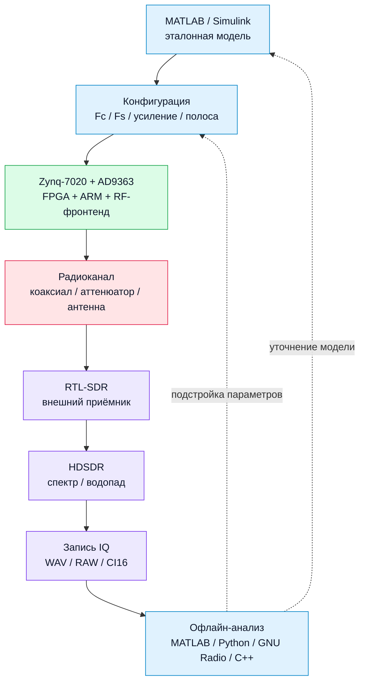

# 03. Аппаратная база курса

## Назначение раздела

Этот раздел знакомит с практическим SDR-стендом курса и объясняет, какой вклад каждый элемент оборудования вносит в общую инженерную цепочку:

**модель → FPGA / RF-фронтенд → внешний приёмник → запись IQ → офлайн-анализ**

## 1. Аппаратная база

В первом блоке используется компактный, но реалистичный SDR-стенд:

- SDR-плата **Zynq-7020 + AD9363**;
- внешний приёмник **RTL-SDR**;
- ПК для моделирования, наблюдения, записи и анализа;
- кабельный или эфирный радиоканал;
- при необходимости аттенюаторы, переходники и согласующие элементы.

## 2. RTL-SDR V3 Pro

Приёмник RTL-SDR используется как внешний инструмент наблюдения. Он позволяет убедиться, что переданный сигнал существует за пределами основной SDR-платы и принимается независимым устройством.

**Роль в курсе:**

- первое обнаружение сигнала;
- наблюдение спектра и водопада в HDSDR;
- запись IQ для офлайн-анализа;
- практическая демонстрация усиления приёмника, шума и перегрузки.

## 3. Плата Xilinx Zynq-7020 + AD9363

Это основная SDR-платформа курса на уровне платы. Она связывает цифровую обработку сигналов с реальным RF-фронтендом.

**Zynq-7020 даёт:**

- процессорную систему ARM для управления и конфигурации;
- программируемую логику FPGA для детерминированной потоковой обработки;
- практический мост между программными моделями и аппаратной реализацией.

**AD9363 даёт:**

- передающий и приёмный RF-тракты;
- преобразование ЦАП/АЦП;
- аналоговую фильтрацию и перенос частоты;
- интерфейс потока I/Q с цифровым трактом обработки.

## 4. Поток SDR-стенда

```mermaid
flowchart TB
    classDef model fill:#E0F2FE,color:#0F172A,stroke:#0284C7,stroke-width:1px;
    classDef fpga fill:#DCFCE7,color:#0F172A,stroke:#16A34A,stroke-width:1px;
    classDef rf fill:#FFE4E6,color:#0F172A,stroke:#E11D48,stroke-width:1px;
    classDef data fill:#EDE9FE,color:#0F172A,stroke:#7C3AED,stroke-width:1px;

    MODEL["MATLAB / Simulink<br/>эталонная модель"]:::model
    CFG["Конфигурация<br/>Fc / Fs / усиление / полоса"]:::model
    BOARD["Zynq-7020 + AD9363<br/>FPGA + ARM + RF-фронтенд"]:::fpga
    LINK["Радиоканал<br/>коаксиал / аттенюатор / антенна"]:::rf
    RTL["RTL-SDR<br/>внешний приёмник"]:::data
    HDSDR["HDSDR<br/>спектр / водопад"]:::data
    IQ["Запись IQ<br/>WAV / RAW / CI16"]:::data
    ANALYSIS["Офлайн-анализ<br/>MATLAB / Python / GNU Radio / C++"]:::model

    MODEL --> CFG --> BOARD --> LINK --> RTL --> HDSDR --> IQ --> ANALYSIS
    ANALYSIS -. подстройка параметров .-> CFG
    ANALYSIS -. уточнение модели .-> MODEL
```

## 5. Варианты соединения

### Через эфир

Преимущества:

- наглядная демонстрация;
- быстрая настройка;
- близко к реальной работе радиосистемы.

Ограничения:

- внешние помехи;
- хуже повторяемость;
- сильная зависимость от расположения антенн и обстановки.

### Через кабель

Преимущества:

- повторяемые измерения;
- контролируемый канал;
- проще сравнивать эксперименты между собой.

Ограничения:

- аттенюатор обязателен;
- прямое неконтролируемое соединение TX с RX опасно для приёмника;
- нужно соблюдать ограничения по уровню на входе.

## 6. Дисциплина уровней сигнала

Никогда не соединяйте передатчик напрямую с приёмником, не понимая уровней сигнала.

Всегда учитывайте:

- максимально допустимый уровень на входе;
- аттенюацию;
- потери в кабелях;
- усиление приёмника;
- признаки ограничения (clipping) и перегрузки.

## 7. Чек-лист перед лабораторной

Перед первой лабораторной убедитесь, что:

- SDR-плата правильно запитана;
- ПК видит RTL-SDR;
- выбранный радиоканал безопасен;
- HDSDR показывает спектр приёмника;
- подготовлено место для записи IQ;
- параметры эксперимента записаны.

## 8. Инженерный вывод

На первом этапе стенд намеренно простой, но он уже содержит полный инженерный цикл SDR:

**генерация → передача → приём → наблюдение → запись → анализ → улучшение**

Это основа для следующих блоков: модуляции, синхронизации, fixed-point реализации, обработки в FPGA и RF-измерений.
