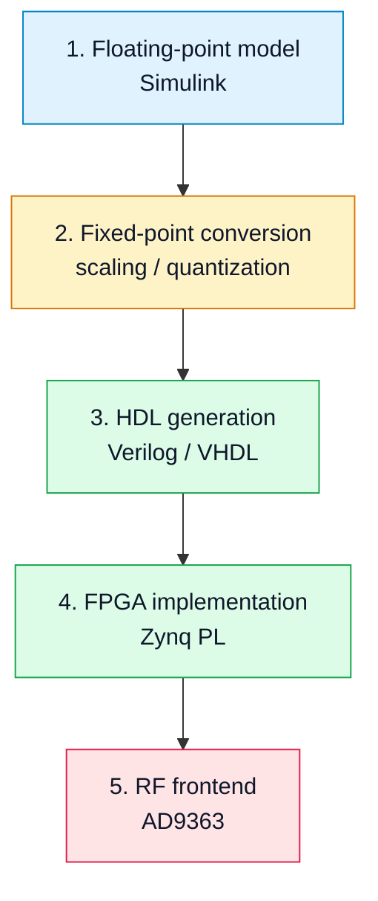

# 04. Bridge: Simulink → FPGA → RF Path

## Why this section matters
This section connects the mathematical signal model with its physical implementation on the SDR board.

Key idea:

**the same signal must be understandable at every level — from Simulink to RF emission.**

## Overall chain



## 1. Floating-point model
In Simulink, the signal is usually represented as:

- real or complex values;
- high-precision numbers;
- unrestricted word length.

This is convenient for:

- algorithm design;
- debugging;
- visualization.

## 2. Fixed-point conversion
When moving to FPGA, the key problem is:

👉 **limited word length**

The designer must define:

- numerical format, for example Q1.15 or Q2.14;
- scaling policy;
- overflow behavior;
- rounding and truncation behavior.

Typical errors:

- amplitude loss;
- clipping;
- quantization noise growth;
- unexpected saturation.

## 3. HDL representation
The model is transformed into HDL code:

- Verilog or VHDL;
- streaming sample processing;
- explicit fixed-point widths;
- clocked pipeline behavior.

Important point:

👉 the model becomes **hardware**, not software.

## 4. FPGA implementation
The FPGA part may include:

- DDS / NCO;
- mixers;
- FIR filters;
- interpolation / decimation;
- AXI-Stream interfaces.

Key constraints:

- LUT, DSP and BRAM resources;
- clock frequency;
- latency;
- timing closure.

## 5. RF path
The FPGA produces a digital stream that is then:

- converted to analog form by DAC;
- shifted to RF frequency;
- passed through analog filters and gain stages.

## Where differences appear

| Level | Main source of mismatch |
|---|---|
| Model | idealized assumptions |
| Fixed-point | quantization and scaling |
| FPGA | latency and resource limits |
| RF | noise, nonlinearity and analog filtering |

## Balanced verification approach
A correct SDR workflow checks the signal at every level:

```text
Simulink → fixed-point → FPGA → RF → RTL-SDR → IQ → offline analysis
```

## Practical conclusion
This bridge is a central element of the course: it shows how theory turns into a real measurable signal and where engineering decisions start to matter.
