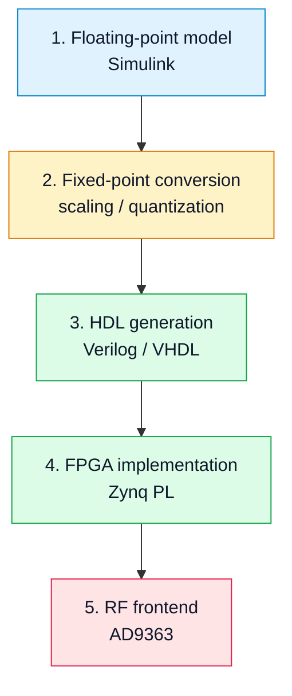

# 04. Мостик: Simulink → FPGA → RF тракт

## Зачем нужен этот раздел
Этот раздел связывает математическую модель сигнала с его физической реализацией на SDR-плате.

Ключевая идея:

**один и тот же сигнал должен быть понятен на всех уровнях — от Simulink до RF-излучения.**

## Общая цепочка



## 1. Floating-point модель
В Simulink сигнал описывается в виде:

- вещественных или комплексных чисел;
- с высокой точностью;
- без ограничений по разрядности.

Это удобно для:
- разработки алгоритма;
- отладки;
- визуализации.

## 2. Fixed-point
При переходе к FPGA возникает ключевая проблема:

👉 **ограниченная разрядность**

Необходимо:
- выбрать формат (например, Q1.15, Q2.14);
- контролировать переполнение;
- учитывать квантование.

Типичные ошибки:
- потеря амплитуды;
- клиппинг;
- рост шума квантования.

## 3. HDL
Модель преобразуется в HDL-код:

- Verilog или VHDL;
- потоковая обработка;
- фиксированная разрядность.

Важно понимать:

👉 модель становится **аппаратной схемой**, а не программой.

## 4. FPGA
На FPGA реализуется:

- DDS / NCO;
- фильтры;
- интерполяция;
- интерфейсы AXI.

Ключевые ограничения:
- ресурсы (LUT, DSP, BRAM);
- частота тактирования;
- задержки.

## 5. RF тракт
FPGA выдаёт цифровой поток, который:

- преобразуется в аналоговый сигнал (DAC);
- переносится на RF частоту;
- проходит через аналоговые фильтры.

## Где появляются расхождения

| Уровень | Тип ошибки |
|---|---|
| Model | идеализация |
| Fixed-point | квантование |
| FPGA | задержки и ресурсы |
| RF | шум и нелинейность |

## Ключевая инженерная идея

👉 Всегда проверять сигнал на каждом уровне:

```text
Simulink → fixed-point → FPGA → RF → RTL-SDR → IQ → анализ
```

## Практический вывод
Этот мостик является центральным элементом курса: он показывает, как теория превращается в реальный измеряемый сигнал.
