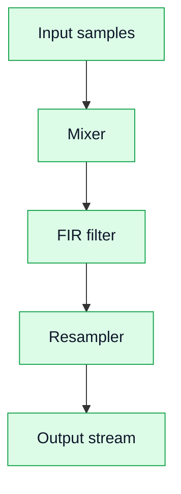

# 05. DSP Chain in FPGA

## Why it matters
This section explains how DSP algorithms are implemented in FPGA as streaming hardware pipelines rather than sequential code.

## Core idea

## Key properties

### Streaming
- one sample per clock cycle;
- continuous data flow.

### Latency
- each block adds delay;
- important for synchronization.

### Throughput
- defined by clock rate;
- can sustain real-time processing.

### Parallelism
- multiple blocks operate simultaneously;
- filters can be parallelized.

## Practical conclusion

FPGA is not a CPU. DSP here is about dataflow architecture and pipelines rather than sequential instructions.
