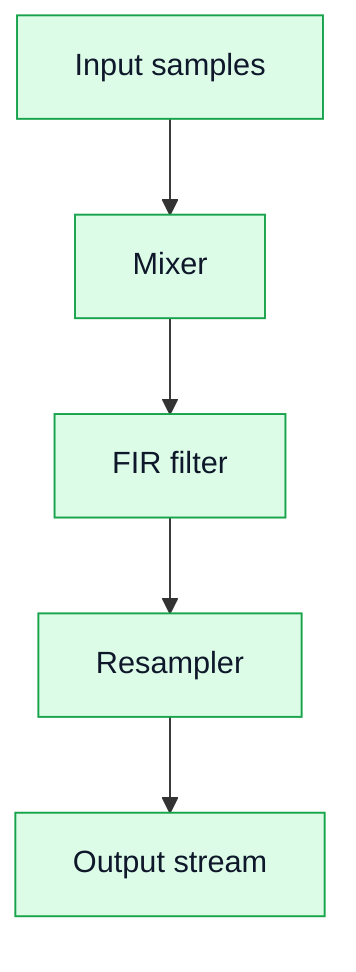

# 05. DSP-цепочка в FPGA

## Зачем это нужно
Этот раздел объясняет, как DSP-алгоритмы реализуются в FPGA не как код, а как потоковая схема.

## Основная идея

## Особенности FPGA реализации

### 1. Streaming
- каждый такт обрабатывается один отсчёт;
- нет «функций», есть pipeline.

### 2. Latency
- каждый блок добавляет задержку;
- важно учитывать при синхронизации.

### 3. Throughput
- определяется частотой тактирования;
- можно обрабатывать поток без остановки.

### 4. Параллелизм
- несколько блоков работают одновременно;
- возможно распараллеливание фильтров.

## Практический вывод

FPGA — это не CPU. DSP здесь — это архитектура данных и потоков, а не последовательный код.
