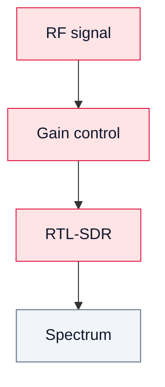

# 06. RF Measurements in SDR

## Goal
Understand real RF limitations: signal level, noise, and overload.

## Key concepts

### Signal level
- too low → buried in noise;
- optimal → good SNR;
- too high → overload.

### Noise
- limits sensitivity;
- affects BER.

### Overload
Signs:
- distorted spectrum;
- harmonics;
- unstable level;
- signal distortion.

## Diagram

## Conclusion

RF limitations affect signal quality as much as DSP.
