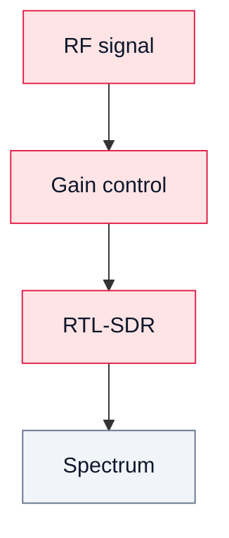

# 06. RF-измерения в SDR

## Цель
Понять реальные ограничения радиотракта: уровень сигнала, шум и перегрузка.

## Основные понятия

### Уровень сигнала
- слишком низкий → сигнал теряется в шуме;
- оптимальный → хороший SNR;
- слишком высокий → перегрузка.

### Шум
- фон, который ограничивает чувствительность;
- влияет на BER.

### Перегрузка
Признаки:
- “грязный” спектр;
- появление гармоник;
- нестабильный уровень;
- искажение сигнала.

## Диаграмма

## Практический вывод

RF-тракт ограничивает качество сигнала так же сильно, как DSP.
