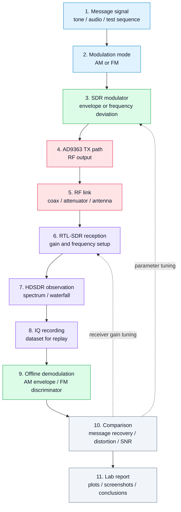

# 12. Laboratory Work 2. AM/FM Modulation and Demodulation

## Goal
Move from a single test tone to simple modulated signals and show how the SDR stand can be used to observe waveform behavior, spectrum, IQ recording, and offline demodulation.

This laboratory work is based on two fundamental modulation types:

- **AM** — amplitude modulation;
- **FM** — frequency modulation.

The goal is not only to see a signal in the spectrum, but also to connect the mathematical model, modulation parameters, RF observation, and offline analysis.

## 1. Learning idea
After Laboratory Work 1, the student already knows how to generate and receive a simple tone. In this lab, the same stand is used for a more meaningful communication experiment:

```text
message → modulator → RF transmission → RTL-SDR/HDSDR → IQ recording → demodulator → comparison with the original message
```

This is the first step from basic chain verification to real analog and digital communication.

## 2. Hardware and software
The same stand is used:

- **Zynq7020 + AD9363** SDR board;
- **RTL-SDR** receiver;
- PC;
- HDSDR;
- MATLAB / Simulink;
- Python;
- GNU Radio;
- cable or over-the-air connection;
- attenuators if required.

## 3. Experiment diagram



## 4. Experiment parameters
The report must document:

| Parameter | Meaning |
|---|---|
| `Fc` | transmit carrier frequency |
| `Fs` | IQ sampling rate |
| `Fm` | message-signal frequency |
| `m` | AM modulation index |
| `Δf` | FM frequency deviation |
| `gain_tx` | transmitter gain |
| `gain_rx` | RTL-SDR gain |
| `format` | IQ recording format |

## 5. Part A — AM modulation
### Tasks
1. Generate a low-frequency message signal.
2. Generate an AM signal on the SDR board or in the reference model.
3. Transmit the signal through the RF path.
4. Receive the signal with RTL-SDR.
5. Observe the carrier and sidebands in the spectrum.
6. Record an IQ file.
7. Perform offline envelope demodulation.
8. Compare the recovered message with the original message.

### Expected observations
For AM, the student should observe:

- the central carrier;
- two sidebands;
- spectral changes when the message frequency changes;
- sideband-level changes when the modulation index changes.

## 6. Part B — FM modulation
### Tasks
1. Generate a low-frequency message signal.
2. Configure the frequency deviation.
3. Generate an FM signal.
4. Receive it with RTL-SDR.
5. Observe spectrum broadening.
6. Record IQ data.
7. Perform offline FM demodulation.
8. Compare the recovered message with the original message.

### Expected observations
For FM, the student should observe:

- occupied bandwidth changes when deviation changes;
- the difference between FM and AM spectra;
- sensitivity to receive-frequency tuning;
- the influence of gain and overload on demodulation quality.

## 7. Offline analysis
For each mode, build:

- time-domain waveform of IQ or recovered message;
- received-signal spectrum;
- demodulated-message spectrum;
- comparison of original and recovered message;
- short distortion estimate.

## 8. Review questions
1. How does AM differ from FM in the spectrum?
2. Why do AM sidebands appear?
3. What is modulation index?
4. What is FM frequency deviation?
5. Why does FM usually occupy a wider bandwidth?
6. What happens when RTL-SDR is overloaded?
7. Why must IQ recordings be saved together with experiment parameters?

## 9. Expected result
After completing this lab, the student should obtain:

- IQ recordings of AM and FM signals;
- HDSDR screenshots;
- spectrum plots;
- recovered messages after demodulation;
- understanding of the link between modulation parameters and observed spectrum.

## 10. Engineering conclusion
This laboratory work turns the stand from a simple tone generator into a basic SDR measurement system. The student starts to see modulation not as an abstract formula, but as a measurable change in waveform, spectrum, and occupied bandwidth.
