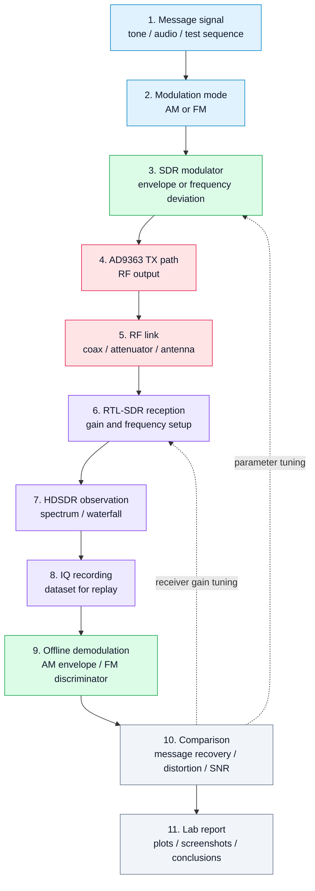

# 12. Лабораторная работа 2. AM/FM модуляция и демодуляция

## Цель работы
Перейти от одиночного тестового тона к простым модулированным сигналам и показать, как SDR-стенд позволяет наблюдать форму сигнала, спектр, запись IQ и последующую демодуляцию.

Лабораторная работа строится вокруг двух базовых типов модуляции:

- **AM** — амплитудная модуляция;
- **FM** — частотная модуляция.

Главная цель — не только увидеть сигнал в спектре, но и связать математическую модель, параметры модуляции, RF-наблюдение и офлайн-анализ.

## 1. Учебная идея
После первой лабораторной студент уже умеет сформировать и принять простой тон. Во второй лабораторной тот же стенд используется для более содержательного эксперимента:

```text
сообщение → модулятор → RF-передача → RTL-SDR/HDSDR → IQ-запись → демодулятор → сравнение с исходным сообщением
```

Это первый шаг от проверки тракта к реальной цифровой и аналоговой связи.

## 2. Оборудование и ПО
Используется тот же стенд:

- SDR-плата **Zynq7020 + AD9363**;
- приёмник **RTL-SDR**;
- ПК;
- HDSDR;
- MATLAB / Simulink;
- Python;
- GNU Radio;
- кабельное или эфирное соединение;
- аттенюаторы при необходимости.

## 3. Диаграмма эксперимента



## 4. Параметры эксперимента
В отчёте должны быть зафиксированы:

| Параметр | Смысл |
|---|---|
| `Fc` | несущая частота передачи |
| `Fs` | частота дискретизации IQ |
| `Fm` | частота информационного сигнала |
| `m` | глубина AM-модуляции |
| `Δf` | девиация частоты для FM |
| `gain_tx` | усиление передающего тракта |
| `gain_rx` | усиление RTL-SDR |
| `format` | формат записи IQ |

## 5. Часть A — AM-модуляция
### Что нужно сделать
1. Сформировать низкочастотный информационный сигнал.
2. Сформировать AM-сигнал на SDR-плате или в модели.
3. Передать сигнал через RF-тракт.
4. Принять сигнал RTL-SDR.
5. Увидеть несущую и боковые полосы в спектре.
6. Записать IQ-файл.
7. Выполнить офлайн-демодуляцию огибающей.
8. Сравнить восстановленное сообщение с исходным.

### Что должно быть видно
Для AM студент должен увидеть:

- центральную несущую;
- две боковые полосы;
- изменение спектра при изменении частоты сообщения;
- изменение уровня боковых полос при изменении глубины модуляции.

## 6. Часть B — FM-модуляция
### Что нужно сделать
1. Сформировать низкочастотный информационный сигнал.
2. Настроить девиацию частоты.
3. Сформировать FM-сигнал.
4. Принять его через RTL-SDR.
5. Наблюдать расширение спектра.
6. Записать IQ.
7. Выполнить офлайн FM-демодуляцию.
8. Сравнить восстановленное сообщение с исходным.

### Что должно быть видно
Для FM студент должен увидеть:

- изменение занимаемой полосы при изменении девиации;
- отличие спектра FM от AM;
- чувствительность результата к настройке частоты приёма;
- влияние уровня и перегрузки на качество демодуляции.

## 7. Офлайн-анализ
Для каждого режима нужно построить:

- временную форму IQ или восстановленного сообщения;
- спектр принятого сигнала;
- спектр демодулированного сообщения;
- сравнение исходного и восстановленного сигнала;
- краткую оценку искажений.

## 8. Контрольные вопросы
1. Чем AM отличается от FM с точки зрения спектра?
2. Почему у AM появляются боковые полосы?
3. Что такое глубина модуляции?
4. Что такое девиация частоты в FM?
5. Почему FM обычно занимает большую полосу?
6. Что произойдёт при перегрузке RTL-SDR?
7. Почему важно сохранять IQ-запись вместе с параметрами эксперимента?

## 9. Ожидаемый результат
После выполнения лабораторной работы студент должен получить:

- IQ-записи AM и FM сигналов;
- скриншоты HDSDR;
- графики спектров;
- восстановленные сообщения после демодуляции;
- понимание связи между параметрами модуляции и наблюдаемым спектром.

## 10. Инженерный вывод
Эта лабораторная работа превращает стенд из простого генератора тона в базовый измерительный SDR-комплекс. Студент начинает видеть, что модуляция — это не абстрактная формула, а измеряемое изменение формы, спектра и полосы сигнала.
