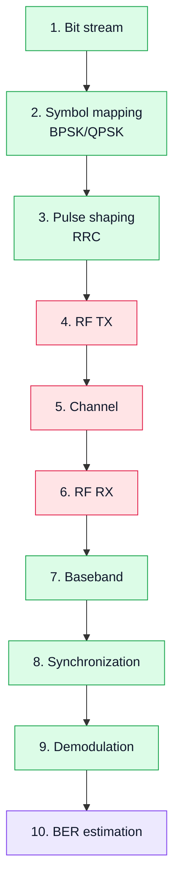

# 13. Laboratory Work 3. Digital Modulation (BPSK/QPSK)

## Goal
Move from analog modulation to digital modulation and demonstrate how information is represented in the complex plane.

This lab covers:

- **BPSK**;
- **QPSK**.

## 1. Learning idea

```text
bit stream → modulation → IQ signal → RF → reception → synchronization → demodulation → BER
```

This is the first step toward real digital communication systems.

## 2. Experiment diagram



## 3. Core concepts

### BPSK
- 1 bit per symbol;
- phase 0 or π;
- robust to noise.

### QPSK
- 2 bits per symbol;
- 4 constellation points;
- higher data rate.

## 4. Tasks

1. Generate a bit stream.
2. Perform modulation (BPSK or QPSK).
3. Transmit the signal.
4. Receive it with RTL-SDR.
5. Perform demodulation.
6. Estimate BER.

## 5. Expected observations

- constellation diagram;
- noise influence;
- synchronization errors;
- BER changes.

## 6. Expected result

The student should:

- understand IQ representation;
- observe constellation;
- evaluate errors;
- connect DSP and RF behavior.

## 7. Engineering conclusion

Digital modulation is the basis of modern communication systems, and SDR allows observing it simultaneously at the model, hardware, and RF levels.
