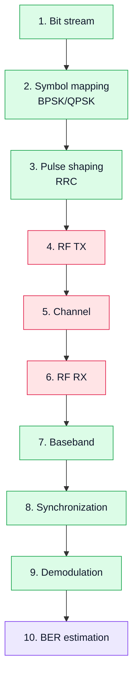

# 13. Лабораторная работа 3. Цифровая модуляция (BPSK/QPSK)

## Цель работы
Перейти от аналоговых видов модуляции к цифровым и показать, как информация кодируется в комплексной плоскости.

В лабораторной работе рассматриваются:

- **BPSK**;
- **QPSK**.

## 1. Учебная идея

```text
битовый поток → модуляция → IQ сигнал → RF → приём → синхронизация → демодуляция → BER
```

Это первый шаг к построению цифровых систем связи.

## 2. Диаграмма эксперимента



## 3. Основные понятия

### BPSK
- 1 бит → 1 символ;
- фаза 0 или π;
- устойчивость к шуму.

### QPSK
- 2 бита → 1 символ;
- 4 точки созвездия;
- выше скорость передачи.

## 4. Что нужно сделать

1. Сгенерировать битовый поток.
2. Выполнить модуляцию (BPSK или QPSK).
3. Передать сигнал.
4. Принять сигнал RTL-SDR.
5. Выполнить демодуляцию.
6. Оценить BER.

## 5. Что должно быть видно

- созвездие (constellation);
- влияние шума;
- ошибки синхронизации;
- изменение BER.

## 6. Ожидаемый результат

Студент должен:

- понять представление сигнала в IQ;
- увидеть созвездие;
- оценить ошибки;
- связать DSP и RF.

## 7. Инженерный вывод

Цифровая модуляция — это основа современных систем связи, и SDR позволяет наблюдать её на всех уровнях одновременно.
