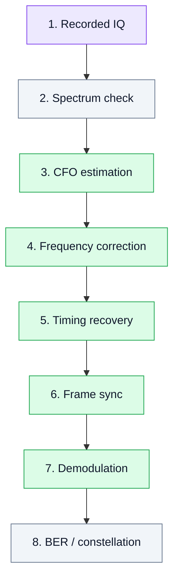

# 14. Laboratory Work 4. Synchronization in an SDR Receiver

## Goal
Demonstrate why digital signal reception requires not only demodulation but also synchronization.

This lab covers three fundamental tasks:

- carrier frequency offset correction (**CFO**);
- timing recovery;
- frame synchronization.

## 1. Learning idea

```text
received IQ → CFO estimation → frequency correction → timing recovery → frame detection → demodulation
```

Without synchronization, even a correctly generated BPSK/QPSK signal may not be demodulated properly.

## 2. Experiment diagram



## 3. Key ideas

- Transmitter and receiver frequencies are never perfectly aligned.
- CFO causes constellation rotation.
- Incorrect sampling time increases symbol errors.
- Packet-based communication requires frame detection.

## 4. Tasks

1. Take a recorded BPSK/QPSK IQ signal.
2. Estimate frequency offset.
3. Apply frequency correction.
4. Compare constellation before and after correction.
5. Perform timing recovery.
6. Detect frame start.
7. Demodulate the signal.
8. Evaluate BER.

## 5. Expected results

- improved constellation stability;
- reduced BER;
- understanding of synchronization loops.

## 6. Engineering conclusion

Synchronization is the boundary between academic demodulation and real receivers. It introduces feedback loops and adaptive processing into the SDR chain.
