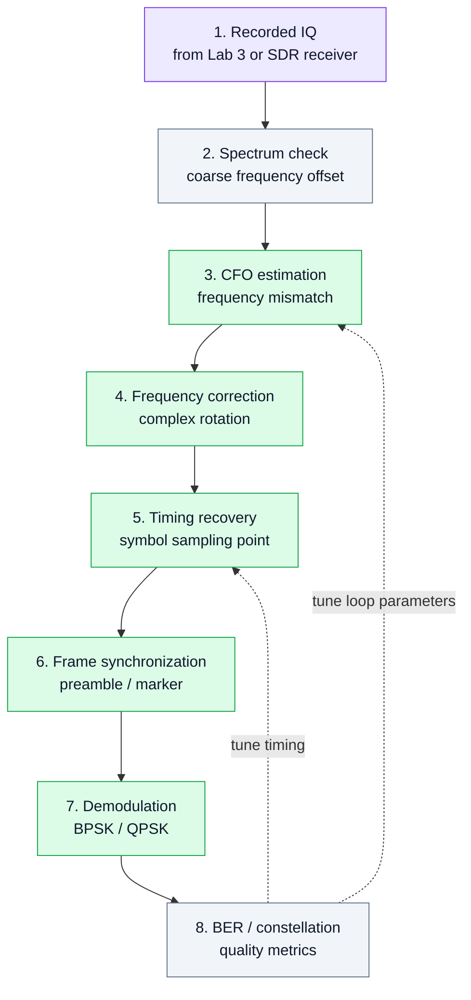

# 14. Laboratory Work 4. Synchronization in an SDR Receiver

## Goal
Demonstrate why digital signal reception requires not only demodulation but also synchronization.

This lab covers three fundamental tasks:

- carrier frequency offset correction (**CFO**);
- timing recovery;
- frame synchronization.

This page is the overview. Each step is a runnable lab later in the course: CFO in [Lab 8.1](/zynq-sdr-course/en/labs/lab-8-1-cfo-estimation-correction/), timing in [Lab 8.3](/zynq-sdr-course/en/labs/lab-8-3-timing-recovery/), frame detection in [Lab 7.4](/zynq-sdr-course/en/labs/lab-7-4-packet-receiver-detection/), the whole chain in [Lab 8.4](/zynq-sdr-course/en/labs/lab-8-4-end-to-end-sync-chain/). Without a recording of your own, use the synthetic QPSK dataset of [Lab 9.5](/zynq-sdr-course/en/labs/lab-9-5-synthetic-qpsk-replay-analysis/).

## 1. Learning idea

```text
received IQ → CFO estimation → frequency correction → timing recovery → frame detection → demodulation
```

Without synchronization, even a correctly generated BPSK/QPSK signal may not be demodulated properly.

## 2. Experiment diagram


```mermaid
flowchart TB
    classDef rx fill:#EDE9FE,color:#0F172A,stroke:#7C3AED,stroke-width:1px;
    classDef dsp fill:#DCFCE7,color:#0F172A,stroke:#16A34A,stroke-width:1px;
    classDef metric fill:#F1F5F9,color:#0F172A,stroke:#64748B,stroke-width:1px;

    IQ["1. Recorded IQ<br/>from Lab 3 or SDR receiver"]:::rx
    SPEC["2. Spectrum check<br/>coarse frequency offset"]:::metric
    CFO["3. CFO estimation<br/>frequency mismatch"]:::dsp
    CORR["4. Frequency correction<br/>complex rotation"]:::dsp
    TIMING["5. Timing recovery<br/>symbol sampling point"]:::dsp
    FRAME["6. Frame synchronization<br/>preamble / marker"]:::dsp
    DEMOD["7. Demodulation<br/>BPSK / QPSK"]:::dsp
    BER["8. BER / constellation<br/>quality metrics"]:::metric

    IQ --> SPEC --> CFO --> CORR --> TIMING --> FRAME --> DEMOD --> BER
    BER -. tune loop parameters .-> CFO
    BER -. tune timing .-> TIMING
```

## 3. Key ideas

- Transmitter and receiver frequencies are never perfectly aligned.
- Even a small CFO rotates the constellation.
- An incorrect symbol sampling point increases errors.
- Packet transmission needs a way to find the start of the frame.

## 4. Tasks

1. Take a recorded BPSK/QPSK IQ signal.
2. Plot the spectrum and estimate the frequency offset.
3. Apply a coarse frequency correction.
4. Plot the constellation before and after the CFO correction.
5. Choose the symbol sampling instant.
6. Find the start of the frame by its preamble or test sequence.
7. Demodulate the signal.
8. Compare the BER before and after synchronization.

## 5. Expected results

- improved constellation stability;
- reduced BER;
- understanding of synchronization loops.

## 6. What the report should include

- the spectrum before correction;
- the CFO estimate;
- the constellation before and after correction;
- a description of the timing-recovery algorithm;
- a description of the frame-sync method;
- the BER before and after synchronization;
- conclusions.

## 7. Review questions

1. What is CFO?
2. Why does CFO rotate the constellation?
3. Why can one not simply take every N-th sample without timing recovery?
4. What is a preamble?
5. How do coarse and fine synchronization differ?
6. Why is BER a convenient final metric?

## 8. Engineering conclusion

Synchronization is the boundary between academic demodulation and a real receiver. After this lab the student sees that an SDR receiver consists not only of filters and a demodulator, but also of a set of estimation, correction and quality-control loops.
