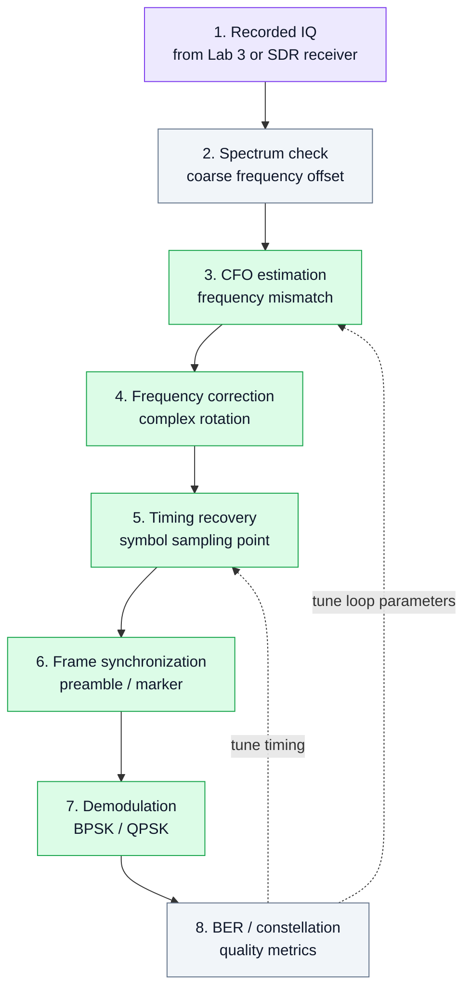

# 14. Лабораторная работа 4. Синхронизация в SDR-приёмнике

## Цель работы
Показать, почему приём цифрового сигнала требует не только демодуляции, но и синхронизации.

В лабораторной работе рассматриваются три базовые задачи:

- коррекция частотного смещения (**CFO**);
- восстановление тактовой синхронизации (**timing recovery**);
- обнаружение начала кадра (**frame synchronization**).

## 1. Учебная идея

```text
принятый IQ → оценка CFO → коррекция частоты → восстановление timing → поиск кадра → демодуляция
```

Без синхронизации даже правильно сформированный BPSK/QPSK сигнал может не демодулироваться корректно.

## 2. Диаграмма эксперимента



## 3. Что должен понять студент

- Частоты передатчика и приёмника никогда не совпадают идеально.
- Даже небольшое CFO вращает созвездие.
- Неправильная точка выборки символа увеличивает ошибки.
- Для пакетной передачи нужен способ найти начало кадра.

## 4. Практические задания

1. Взять IQ-запись BPSK/QPSK сигнала.
2. Построить спектр и оценить частотное смещение.
3. Выполнить грубую коррекцию частоты.
4. Построить созвездие до и после коррекции CFO.
5. Подобрать момент выборки символов.
6. Найти начало кадра по преамбуле или тестовой последовательности.
7. Выполнить демодуляцию.
8. Сравнить BER до и после синхронизации.

## 5. Что должно быть в отчёте

- спектр до коррекции;
- оценка CFO;
- созвездие до и после коррекции;
- описание алгоритма timing recovery;
- описание способа frame sync;
- BER до и после синхронизации;
- выводы.

## 6. Контрольные вопросы

1. Что такое CFO?
2. Почему CFO вращает созвездие?
3. Почему нельзя просто брать каждый N-й отсчёт без timing recovery?
4. Что такое преамбула?
5. Чем отличается грубая и точная синхронизация?
6. Почему BER является удобной итоговой метрикой?

## 7. Инженерный вывод

Синхронизация — это граница между учебной демодуляцией и реальным приёмником. После этой лабораторной студент видит, что SDR-приёмник состоит не только из фильтров и демодулятора, но и из набора контуров оценки, коррекции и контроля качества.
