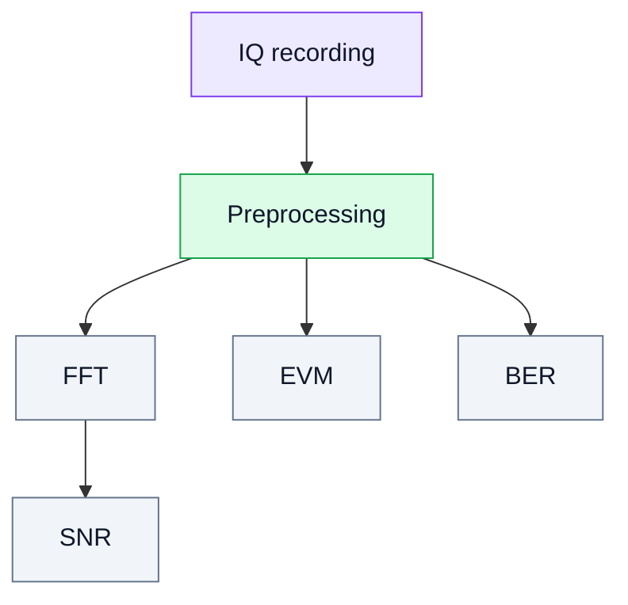

# 15. Signal Quality Metrics: FFT, SNR, EVM and BER

## Goal
Learn how to evaluate SDR experiments quantitatively, not only visually.

Main metrics:

- **FFT / spectrum** — frequency-domain representation;
- **SNR** — signal-to-noise ratio;
- **EVM** — error vector magnitude;
- **BER** — bit error rate.

## 1. Why metrics matter
In SDR it is not enough to say “the signal is visible”. We need to answer:

- how strong the signal is compared to noise;
- whether the receiver is overloaded;
- how close the constellation is to the ideal;
- how many bit errors occur.

## 2. Analysis diagram

## 3. FFT
Used for:

- detecting tones;
- estimating bandwidth;
- identifying spurious components;
- diagnosing overload.

## 4. SNR
Indicates how strong the signal is relative to noise.

## 5. EVM
Measures how far received constellation points deviate from ideal ones.

## 6. BER
Final metric of digital communication quality.

## 7. Conclusion
Metrics transform SDR experiments from visual inspection into engineering measurements.
