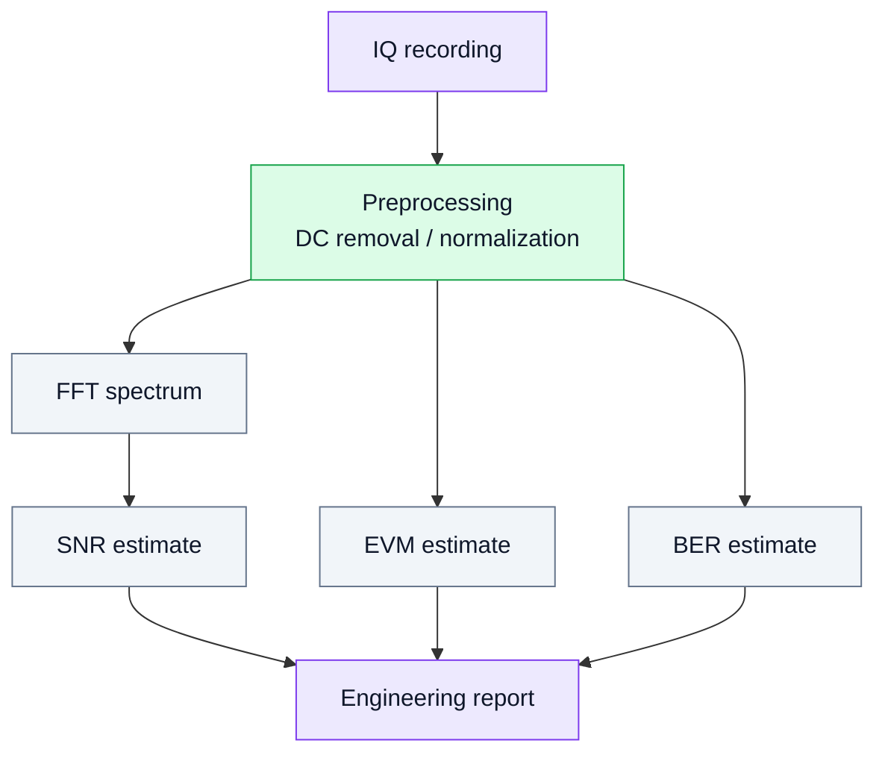

# 15. Signal Quality Metrics: FFT, SNR, EVM and BER

## Goal
Learn how to evaluate SDR experiments quantitatively, not only visually.

Main metrics:

- **FFT / spectrum** — frequency-domain representation;
- **SNR** — signal-to-noise ratio;
- **EVM** — error vector magnitude;
- **BER** — bit error rate.

## 1. Why metrics matter
In SDR it is not enough to say “the signal is visible”. An engineering answer is needed:

- how strong the signal is compared to noise;
- whether the receiver is overloaded;
- how close the constellation is to the ideal;
- how many bits are received with errors.

## 2. Analysis diagram


```mermaid
flowchart TB
    classDef data fill:#EDE9FE,color:#0F172A,stroke:#7C3AED,stroke-width:1px;
    classDef metric fill:#F1F5F9,color:#0F172A,stroke:#64748B,stroke-width:1px;
    classDef dsp fill:#DCFCE7,color:#0F172A,stroke:#16A34A,stroke-width:1px;

    IQ["IQ recording"]:::data
    PRE["Preprocessing<br/>DC removal / normalization"]:::dsp
    FFT["FFT spectrum"]:::metric
    SNR["SNR estimate"]:::metric
    EVM["EVM estimate"]:::metric
    BER["BER estimate"]:::metric
    REPORT["Engineering report"]:::data

    IQ --> PRE --> FFT --> SNR --> REPORT
    PRE --> EVM --> REPORT
    PRE --> BER --> REPORT
```

## 3. FFT
FFT is used for:

- finding the tone peak;
- estimating the occupied bandwidth;
- finding spurious components;
- diagnosing overload.

## 4. SNR
SNR shows how far the useful signal is above the noise:

```text
SNR[dB] = 10·log10(P_signal / P_noise)
```

Both powers must be measured over the same bandwidth; an SNR without its bandwidth is not a number you can compare.

Engineering meaning:

- low SNR → the signal is hard to see;
- high SNR → there is margin;
- a very high level with a dirty spectrum → possible overload.

## 5. EVM
EVM shows how far the received constellation points are from the ideal ones:

```text
EVM_rms = sqrt( Σ |r[k] − s[k]|² / Σ |s[k]|² )
```

where `r[k]` are the received symbols after synchronization and `s[k]` the ideal ones.

Especially useful for:

- BPSK;
- QPSK;
- QAM;
- comparing the model with the hardware.

## 6. BER
BER is the final metric of digital reception:

```text
BER = bit errors / compared bits
```

Always give the number of compared bits: `BER = 0` over 280 bits says much less than over a million. With zero errors in `N` bits, the 95 % upper bound is about `3/N`.

If BER is high, the cause may be:

- noise;
- CFO;
- poor timing;
- wrong demodulation;
- overload of the chain.

## 7. Where the course goes further
- The exact definitions used in the course reports, including confidence intervals: [Digital-link metric calculations](/zynq-sdr-course/digital-link-metrics/).
- Why a good SNR does not guarantee a good BER: [Lab 8.7](/zynq-sdr-course/en/labs/lab-8-7-snr-vs-ber-traps/).

## 8. Conclusion
Metrics turn a laboratory work from visual observation into an engineering measurement.
