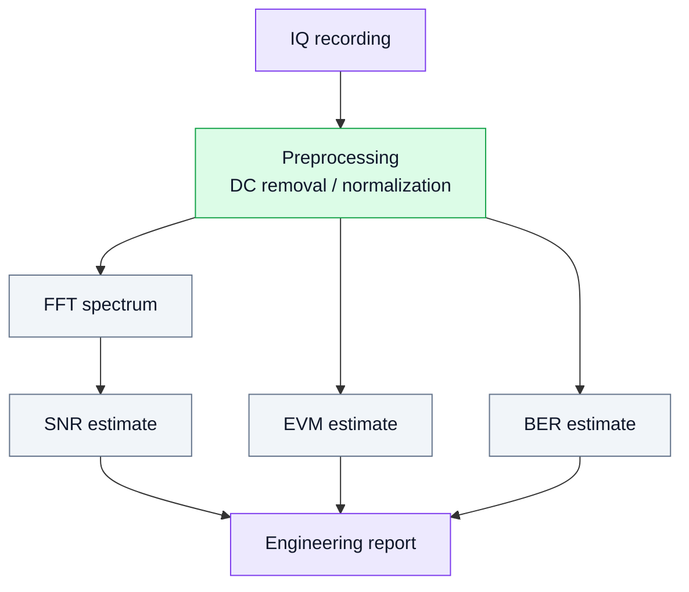

# 15. Метрики качества сигнала: FFT, SNR, EVM и BER

## Цель раздела
Научиться оценивать качество SDR-эксперимента не только визуально, но и количественно.

Основные метрики:

- **FFT / spectrum** — частотная картина сигнала;
- **SNR** — отношение сигнал/шум;
- **EVM** — ошибка векторной модуляции;
- **BER** — вероятность битовой ошибки.

## 1. Зачем нужны метрики
В SDR недостаточно сказать “сигнал виден”. Нужно ответить инженерно:

- насколько сигнал сильнее шума;
- есть ли перегрузка;
- насколько созвездие похоже на идеальное;
- сколько бит принимается с ошибками.

## 2. Диаграмма анализа

## 3. FFT
FFT используется для:

- поиска пика тона;
- оценки занимаемой полосы;
- поиска паразитных составляющих;
- диагностики перегрузки.

## 4. SNR
SNR показывает, насколько полезный сигнал выше шума.

Инженерный смысл:

- низкий SNR → плохо видно сигнал;
- высокий SNR → есть запас;
- слишком высокий уровень при грязном спектре → возможна перегрузка.

## 5. EVM
EVM показывает, насколько принятые точки созвездия отличаются от идеальных.

Особенно полезно для:

- BPSK;
- QPSK;
- QAM;
- сравнения модели и железа.

## 6. BER
BER — итоговая метрика цифрового приёма.

Если BER высок:

- есть шум;
- есть CFO;
- плохой timing;
- неверная демодуляция;
- перегрузка тракта.

## 7. Практический вывод
Метрики превращают лабораторную работу из визуального наблюдения в инженерное измерение.
