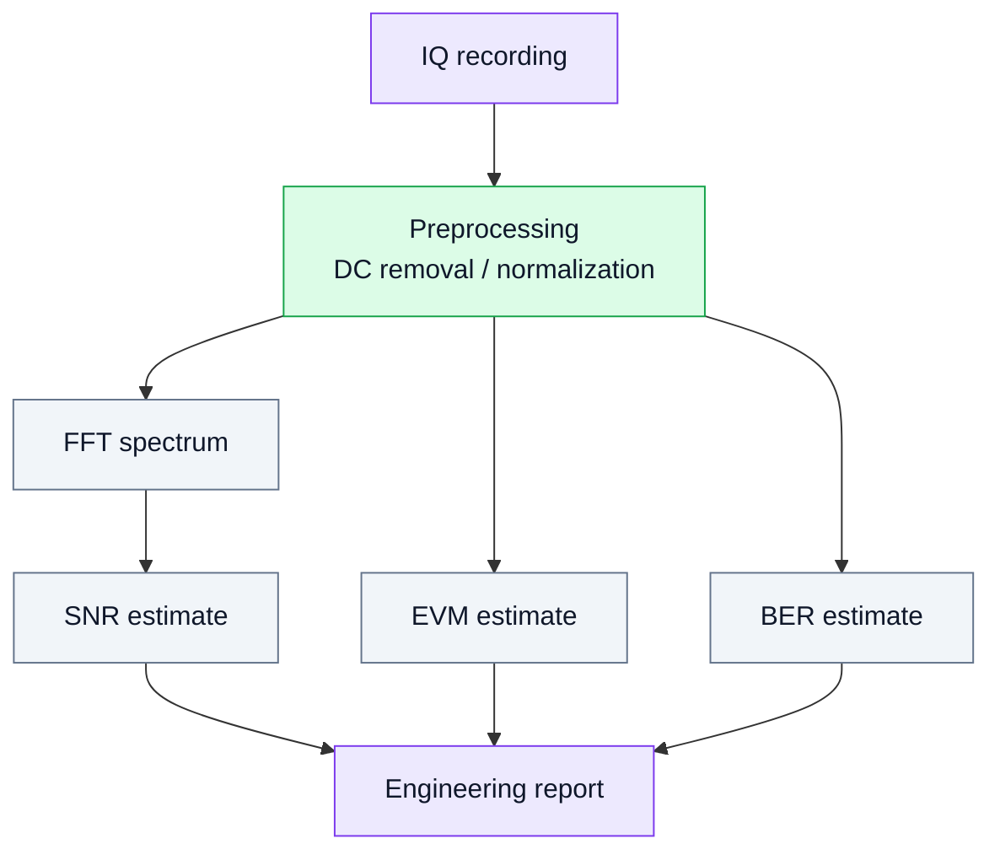

# 15. Метрики качества сигнала: FFT, SNR, EVM и BER

## Цель раздела
Научиться оценивать качество SDR-эксперимента не только визуально, но и количественно.

Основные метрики:

- **FFT / spectrum** — частотная картина сигнала;
- **SNR** — отношение сигнал/шум;
- **EVM** — ошибка векторной модуляции;
- **BER** — вероятность битовой ошибки.

## 1. Зачем нужны метрики
В SDR недостаточно сказать “сигнал виден”. Нужно ответить инженерно:

- насколько сигнал сильнее шума;
- есть ли перегрузка;
- насколько созвездие похоже на идеальное;
- сколько бит принимается с ошибками.

## 2. Диаграмма анализа


```mermaid
flowchart TB
    classDef data fill:#EDE9FE,color:#0F172A,stroke:#7C3AED,stroke-width:1px;
    classDef metric fill:#F1F5F9,color:#0F172A,stroke:#64748B,stroke-width:1px;
    classDef dsp fill:#DCFCE7,color:#0F172A,stroke:#16A34A,stroke-width:1px;

    IQ["IQ recording"]:::data
    PRE["Preprocessing<br/>DC removal / normalization"]:::dsp
    FFT["FFT spectrum"]:::metric
    SNR["SNR estimate"]:::metric
    EVM["EVM estimate"]:::metric
    BER["BER estimate"]:::metric
    REPORT["Engineering report"]:::data

    IQ --> PRE --> FFT --> SNR --> REPORT
    PRE --> EVM --> REPORT
    PRE --> BER --> REPORT
```

## 3. FFT
FFT используется для:

- поиска пика тона;
- оценки занимаемой полосы;
- поиска паразитных составляющих;
- диагностики перегрузки.

## 4. SNR
SNR показывает, насколько полезный сигнал выше шума:

```text
SNR[dB] = 10·log10(P_signal / P_noise)
```

Обе мощности нужно измерять в одной и той же полосе; SNR без указания полосы — не то число, которое можно сравнивать.

Инженерный смысл:

- низкий SNR → плохо видно сигнал;
- высокий SNR → есть запас;
- слишком высокий уровень при грязном спектре → возможна перегрузка.

## 5. EVM
EVM показывает, насколько принятые точки созвездия отличаются от идеальных:

```text
EVM_rms = sqrt( Σ |r[k] − s[k]|² / Σ |s[k]|² )
```

где `r[k]` — принятые символы после синхронизации, `s[k]` — идеальные.

Особенно полезно для:

- BPSK;
- QPSK;
- QAM;
- сравнения модели и железа.

## 6. BER
BER — итоговая метрика цифрового приёма:

```text
BER = bit errors / compared bits
```

Всегда указывайте число сравнённых бит: `BER = 0` на 280 битах говорит гораздо меньше, чем на миллионе. При нуле ошибок на `N` битах верхняя граница с доверием 95 % — примерно `3/N`.

Если BER высок, причиной может быть:

- есть шум;
- есть CFO;
- плохой timing;
- неверная демодуляция;
- перегрузка тракта.

## 7. Куда курс идёт дальше
- Точные определения, которые используются в отчётах курса, включая доверительные интервалы: [Расчёт метрик цифрового канала](/zynq-sdr-course/ru/digital-link-metrics/).
- Почему хороший SNR не гарантирует хорошего BER: [Лабораторная 8.7](/zynq-sdr-course/ru/labs/lab-8-7-snr-vs-ber-traps/).

## 8. Практический вывод
Метрики превращают лабораторную работу из визуального наблюдения в инженерное измерение.
