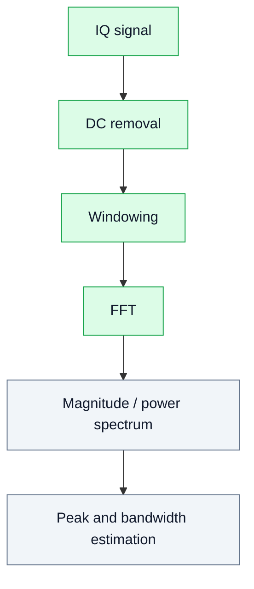

# 16. FFT and Spectral Analysis

## Goal
Understand how to correctly interpret signal spectra in SDR experiments.

FFT is one of the most frequently used tools in SDR, but it is also one of the easiest tools to misuse.

## 1. Main problems

### Spectral leakage
Leakage appears when the observed signal does not fit an integer number of periods inside the analysis window.

Typical symptoms:

- energy spreads across nearby frequency bins;
- a single tone does not look like a single narrow bin;
- weak components may be hidden by leakage from stronger ones.

### Frequency resolution
Resolution depends on FFT length and sampling rate.

```text
Δf = Fs / Nfft
```

Where:

- `Fs` — sampling rate;
- `Nfft` — FFT size;
- `Δf` — bin spacing.

### Windowing
Windows reduce leakage at the cost of widening the main lobe.

Common windows:

- rectangular;
- Hann;
- Hamming;
- Blackman.

## 2. Analysis chain



## 3. Practical recommendations

- Always document `Fs`, `Nfft`, window type, and scaling.
- Use the same FFT settings when comparing experiments.
- Do not estimate signal quality from a screenshot only.
- Check whether the receiver is overloaded before trusting spectral peaks.
- Combine FFT with SNR, EVM, or BER when possible.

## 4. SDR examples

### Tone experiment
FFT is used to confirm tone frequency and estimate noise floor.

### AM/FM experiment
FFT shows carrier, sidebands, and occupied bandwidth.

### Digital modulation
FFT shows occupied bandwidth and spectral shaping.

## 5. Engineering conclusion
FFT is not just a plot. It is a measurement tool that requires correct scaling, windowing, and interpretation.
