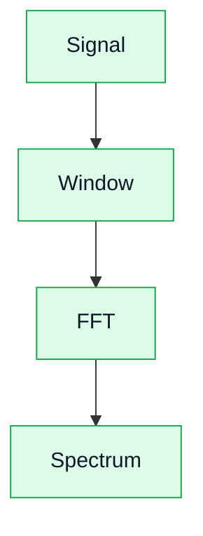

# 16. FFT и спектральный анализ

## Цель
Понять, как правильно интерпретировать спектр сигнала.

## Основные проблемы

### Leakage
- возникает при несогласованности частоты и окна;
- приводит к “размазыванию” спектра.

### Разрешение
- зависит от длины FFT;
- чем больше точек, тем лучше разрешение.

### Окна
- Hann;
- Hamming;
- Blackman.

## Диаграмма

## Практический вывод

FFT — это инструмент, который легко использовать неправильно. Важно понимать ограничения.
