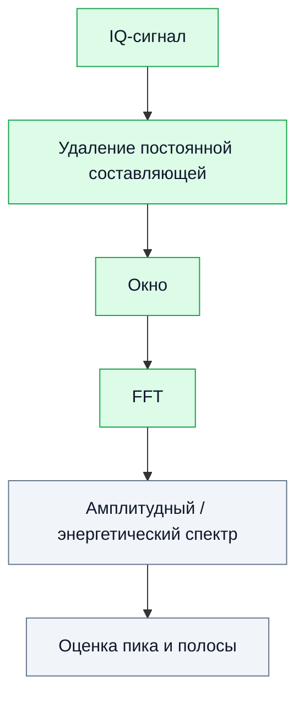

# 16. FFT и спектральный анализ

## Цель
Понять, как правильно интерпретировать спектры сигналов в SDR-экспериментах.

FFT — один из самых востребованных инструментов в SDR, но и один из тех, которые легче всего применить неправильно.

## 1. Основные проблемы

### Растекание спектра (leakage)
Растекание возникает, когда в окно анализа не укладывается целое число периодов наблюдаемого сигнала.

Типичные признаки:

- энергия расползается по соседним частотным бинам;
- одиночный тон не выглядит как один узкий бин;
- слабые составляющие могут прятаться под растеканием от сильных.

### Разрешение по частоте
Разрешение зависит от длины FFT и частоты дискретизации.

```text
Δf = Fs / Nfft
```

Где:

- `Fs` — частота дискретизации;
- `Nfft` — размер FFT;
- `Δf` — шаг между бинами.

Пример со страницы 09: при `Fs = 2,4 МГц` и `Nfft = 4096` получается `Δf = 585,9 Гц`, поэтому тон 200 кГц определяется как 199 804,7 Гц — ближайший бин. При `Nfft = 65536` бин равен 36,6 Гц, и пик оказывается на 199 987,8 Гц. Более длинное FFT точнее разрешает частоту, но требует и более длинной стабильной записи.

### Оконные функции
Окна уменьшают растекание ценой расширения главного лепестка.

Распространённые окна:

- прямоугольное;
- Ханна (Hann);
- Хэмминга (Hamming);
- Блэкмана (Blackman).

## 2. Цепочка анализа


```mermaid
flowchart TB
    classDef dsp fill:#DCFCE7,color:#0F172A,stroke:#16A34A,stroke-width:1px;
    classDef metric fill:#F1F5F9,color:#0F172A,stroke:#64748B,stroke-width:1px;

    SIG["IQ-сигнал"]:::dsp
    DC["Удаление постоянной составляющей"]:::dsp
    WIN["Окно"]:::dsp
    FFT["FFT"]:::dsp
    MAG["Амплитудный / энергетический спектр"]:::metric
    PEAK["Оценка пика и полосы"]:::metric

    SIG --> DC --> WIN --> FFT --> MAG --> PEAK
```

## 3. Практические рекомендации

- Всегда записывайте `Fs`, `Nfft`, тип окна и масштабирование.
- При сравнении экспериментов используйте одинаковые настройки FFT.
- Не оценивайте качество сигнала только по скриншоту.
- Прежде чем доверять спектральным пикам, проверьте, не перегружен ли приёмник.
- По возможности дополняйте FFT метриками SNR, EVM или BER.

## 4. Примеры из SDR

### Эксперимент с тоном
FFT подтверждает частоту тона и позволяет оценить уровень шума.

### Эксперимент с AM/FM
FFT показывает несущую, боковые полосы и занимаемую полосу.

### Цифровая модуляция
FFT показывает занимаемую полосу и формирование спектра.

## 5. Инженерный вывод
FFT — не просто график. Это измерительный инструмент, требующий правильного масштабирования, выбора окна и интерпретации.
