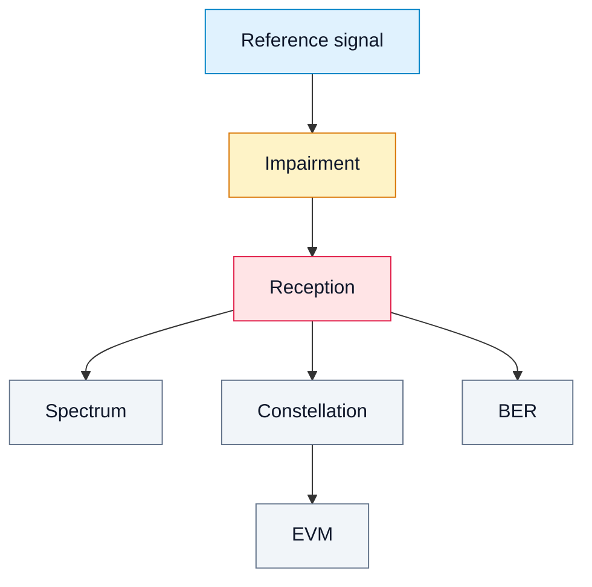

# 16. Laboratory Work 5. SDR Impairments: noise, CFO, mismatch and clipping

## Goal
Demonstrate how real-world impairments affect spectrum, constellation, EVM and BER.

The lab covers four typical effects:

- noise;
- carrier frequency offset (CFO);
- I/Q or gain mismatch;
- clipping and overload.

## 1. Learning idea

```text
ideal signal → impairment → reception → metrics → engineering conclusion
```

## 2. Experiment diagram



## 3. Tasks

1. Take a reference IQ signal.
2. Add noise and evaluate SNR.
3. Add CFO and observe constellation rotation.
4. Add gain mismatch.
5. Introduce clipping.
6. Compare FFT, EVM and BER.

## 4. Conclusion

Real SDR systems always contain impairments. The engineering task is to measure and compensate them.
