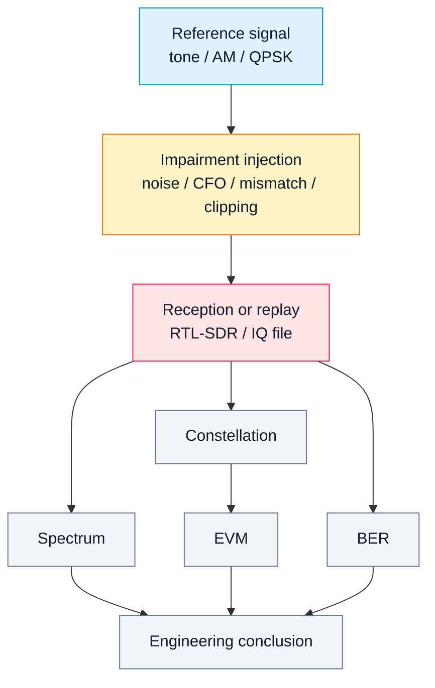

# 16. Laboratory Work 5. SDR Impairments: noise, CFO, mismatch and clipping

## Goal
Demonstrate how real-world impairments of the chain affect the spectrum, constellation, EVM and BER.

The lab covers four typical effects:

- noise;
- carrier frequency offset (**CFO**);
- I/Q imbalance or gain mismatch;
- overload and clipping.

This page is the overview. The runnable versions are [Lab 8.8](/zynq-sdr-course/en/labs/lab-8-8-qpsk-modem-impairments/) (a QPSK modem with noise, CFO and imbalance), [Lab 6.5](/zynq-sdr-course/en/labs/lab-6-5-rf-impairment-calibration/) (DC, I/Q imbalance and LO leakage of a receiver) and [Lab 6.2](/zynq-sdr-course/en/labs/lab-6-2-gain-staging-and-overload/) (gain staging and overload).

## 1. Learning idea

```text
ideal signal → added impairment → reception → metrics → conclusion about the chain
```

This lab connects DSP, RF and measurement metrics.

## 2. Experiment diagram


```mermaid
flowchart TB
    classDef model fill:#E0F2FE,color:#0F172A,stroke:#0284C7,stroke-width:1px;
    classDef impairment fill:#FEF3C7,color:#0F172A,stroke:#D97706,stroke-width:1px;
    classDef rf fill:#FFE4E6,color:#0F172A,stroke:#E11D48,stroke-width:1px;
    classDef metric fill:#F1F5F9,color:#0F172A,stroke:#64748B,stroke-width:1px;

    REF["Reference signal<br/>tone / AM / QPSK"]:::model
    IMP["Impairment injection<br/>noise / CFO / mismatch / clipping"]:::impairment
    RX["Reception or replay<br/>RTL-SDR / IQ file"]:::rf
    SPEC["Spectrum"]:::metric
    CONST["Constellation"]:::metric
    EVM["EVM"]:::metric
    BER["BER"]:::metric
    REPORT["Engineering conclusion"]:::metric

    REF --> IMP --> RX --> SPEC --> REPORT
    RX --> CONST --> EVM --> REPORT
    RX --> BER --> REPORT
```

## 3. Tasks

1. Take a reference IQ signal.
2. Add noise and evaluate the change in SNR.
3. Add CFO and observe the constellation rotate.
4. Model a gain mismatch between I and Q.
5. Introduce clipping and find the signs of overload in the spectrum.
6. Compare FFT, EVM and BER for all cases.

## 4. What the report should include

- parameters of the source signal;
- the type of impairment;
- spectrum before/after;
- constellation before/after;
- EVM;
- BER;
- engineering conclusion.

## 5. Review questions

1. Why does noise increase BER?
2. How does CFO show up on the constellation?
3. Why is clipping dangerous?
4. Why can overload look like new spectral components appearing?
5. Why is EVM convenient for QPSK/QAM?

## 6. Engineering conclusion

A real SDR chain always contains impairments. The engineering task is not to pretend the chain is ideal, but to measure, understand and compensate these effects.
