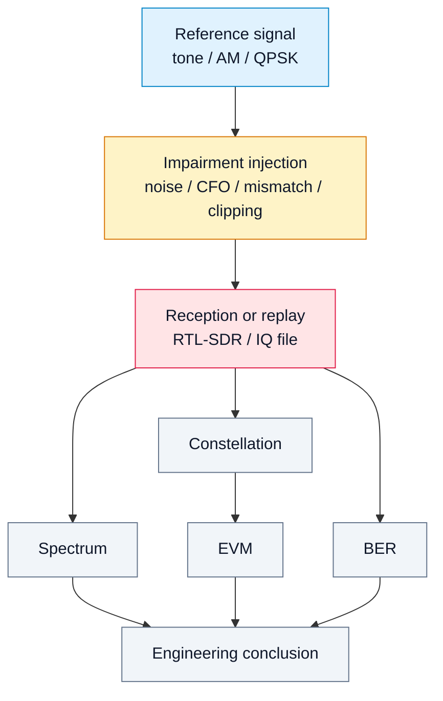

# 16. Лабораторная работа 5. Нарушения в SDR-тракте: шум, CFO, mismatch и clipping

## Цель работы
Показать, как реальные нарушения тракта влияют на спектр, созвездие, EVM и BER.

Рассматриваются четыре типовых эффекта:

- шум;
- частотное смещение (**CFO**);
- дисбаланс I/Q или gain mismatch;
- перегрузка и clipping.

## 1. Учебная идея

```text
идеальный сигнал → добавление нарушения → приём → метрики → вывод о качестве тракта
```

Эта лабораторная работа связывает DSP, RF и измерительные метрики.

## 2. Диаграмма эксперимента



## 3. Практические задания

1. Взять эталонный IQ-сигнал.
2. Добавить шум и оценить изменение SNR.
3. Добавить CFO и посмотреть вращение созвездия.
4. Смоделировать gain mismatch между I и Q.
5. Ввести clipping и найти признаки перегрузки в спектре.
6. Сравнить FFT, EVM и BER для всех случаев.

## 4. Что должно быть в отчёте

- параметры исходного сигнала;
- тип нарушения;
- спектр до/после;
- созвездие до/после;
- EVM;
- BER;
- инженерный вывод.

## 5. Контрольные вопросы

1. Почему шум увеличивает BER?
2. Как CFO проявляется на созвездии?
3. Чем опасен clipping?
4. Почему перегрузка может выглядеть как появление новых спектральных составляющих?
5. Почему EVM удобна для QPSK/QAM?

## 6. Инженерный вывод

Реальный SDR-тракт всегда содержит нарушения. Инженерная задача состоит не в том, чтобы считать тракт идеальным, а в том, чтобы измерять, понимать и компенсировать эти эффекты.
