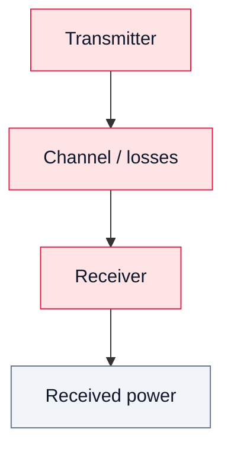

# 17. Link Budget in SDR Systems

## Goal
Estimate whether a transmitted signal can be successfully received.

## 1. Basic equation

```text
Prx = Ptx + Gtx + Grx - Losses
```

Where:

- `Ptx` — transmit power;
- `Gtx` — transmit gain;
- `Grx` — receive gain;
- `Losses` — path and cable losses.

## 2. Components of the link

### Transmitter
- output power;
- RF frontend characteristics.

### Channel
- cable loss;
- free-space path loss;
- attenuation;
- reflections.

### Receiver
- antenna gain;
- LNA gain;
- SDR gain settings.

## 3. Practical SDR considerations

- RTL-SDR has limited dynamic range;
- too much gain leads to clipping;
- too little gain leads to poor SNR;
- near-field setups behave differently from far-field links.

## 4. Diagram



## 5. Engineering conclusion

Link budget allows predicting whether a signal will be visible before performing the experiment.
