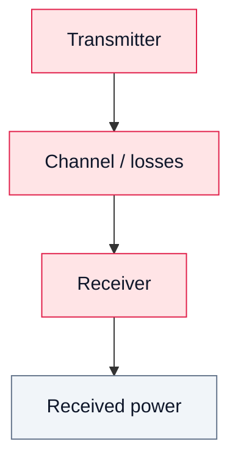

# 17. Link Budget in SDR Systems

## Goal
Estimate whether a transmitted signal can be successfully received.

## 1. Basic equation

```text
Prx = Ptx + Gtx + Grx - Lpath - Lcables
```

Where (all in decibels):

- `Ptx` — transmitter output power, dBm;
- `Gtx`, `Grx` — gains of the transmit and receive **antennas**, dBi (not the receiver's amplifier gain);
- `Lpath` — propagation loss between the antennas;
- `Lcables` — cable, connector and attenuator losses.

In free space the path loss is

```text
FSPL[dB] = 20·log10(d[m]) + 20·log10(f[Hz]) − 147.55
```

The receiver's own gain (LNA, SDR gain setting) raises the signal and the noise together, so it does not appear in the link budget; it decides whether the ADC sees the signal at a sensible level, not how far it is above the noise.

## 2. Components of the link

### Transmitter
- output power;
- RF frontend characteristics.

### Channel
- cable loss;
- free-space path loss;
- attenuation;
- reflections.

### Receiver
- antenna gain;
- noise figure (how much noise the receiver adds);
- SDR gain settings (for the level at the ADC, see above).

## 3. Worked example
A tone at 915 MHz, `Ptx = −10 dBm`, simple antennas of about 0 dBi, 3 m apart, 1 dB of cable at each end:

```text
FSPL = 20·log10(3) + 20·log10(915e6) − 147.55 ≈ 41.2 dB
Prx  = −10 + 0 + 0 − 41.2 − 2 ≈ −53.2 dBm
```

Is that enough? Compare it with the receiver's noise floor over the observed bandwidth. Thermal noise is −174 dBm in 1 Hz; over 2.4 MHz it is `−174 + 10·log10(2.4e6) ≈ −110.2 dBm`, and a receiver with a 6 dB noise figure raises it to about −104.2 dBm. The tone is therefore about 51 dB above the noise across the whole 2.4 MHz, and much more inside a single FFT bin, so it will be easy to see.

The same arithmetic warns in the other direction: by cable, without the 41 dB of free-space loss, the same −10 dBm would arrive at about −12 dBm, enough to overload a receiver set to high gain. That is why the cable setups of the course always include an attenuator.

## 4. Practical SDR considerations

- RTL-SDR has limited dynamic range;
- too much gain leads to clipping;
- too little gain leads to poor SNR;
- the free-space formula assumes the far field: at 915 MHz the wavelength is about 0.33 m, so at a few metres it holds roughly, while at a few centimetres the coupling between antennas is unpredictable;
- indoors, reflections from walls and furniture make the real loss vary by several dB when an antenna moves by a few centimetres.

## 5. Diagram


```mermaid
flowchart TB
    classDef rf fill:#FFE4E6,color:#0F172A,stroke:#E11D48;
    classDef metric fill:#F1F5F9,color:#0F172A,stroke:#64748B;

    TX["Transmitter"]:::rf
    CH["Channel / losses"]:::rf
    RX["Receiver"]:::rf
    P["Received power"]:::metric

    TX --> CH --> RX --> P
```

## 6. Review questions
1. Why does the receiver's gain setting not appear in the link budget?
2. How much does the free-space loss grow when the distance doubles? When the frequency doubles?
3. In the worked example, what transmitter power would bring the tone down to 10 dB above the noise in 2.4 MHz?
4. Why can a cable connection be more dangerous for the receiver than an over-the-air one?

## 7. Engineering conclusion

Link budget allows predicting whether a signal will be visible, and whether it will overload the receiver, before performing the experiment.
