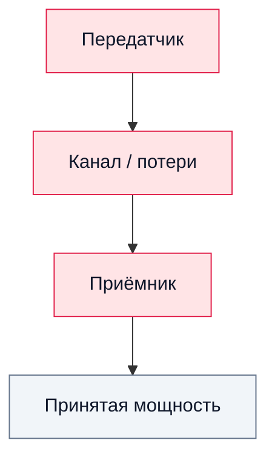

# 17. Энергетический бюджет радиолинии в SDR

## Цель
Оценить, может ли переданный сигнал быть успешно принят.

## 1. Основная формула

```text
Prx = Ptx + Gtx + Grx - Lpath - Lcables
```

Где (всё в децибелах):

- `Ptx` — выходная мощность передатчика, дБм;
- `Gtx`, `Grx` — усиление передающей и приёмной **антенн**, дБи (не усиление усилителя приёмника);
- `Lpath` — потери распространения между антеннами;
- `Lcables` — потери в кабелях, разъёмах и аттенюаторах.

В свободном пространстве потери на трассе равны

```text
FSPL[dB] = 20·log10(d[m]) + 20·log10(f[Hz]) − 147.55
```

Собственное усиление приёмника (LNA, настройка усиления SDR) поднимает сигнал и шум вместе, поэтому в бюджет линии оно не входит; оно определяет, с каким уровнем сигнал придёт на АЦП, а не насколько он выше шума.

## 2. Составляющие линии

### Передатчик
- выходная мощность;
- характеристики RF-фронтенда.

### Канал
- потери в кабеле;
- потери в свободном пространстве;
- аттенюация;
- отражения.

### Приёмник
- усиление антенны;
- коэффициент шума (сколько шума добавляет сам приёмник);
- настройка усиления SDR (для уровня на АЦП, см. выше).

## 3. Разобранный пример
Тон на 915 МГц, `Ptx = −10 дБм`, простые антенны около 0 дБи на расстоянии 3 м, по 1 дБ потерь в кабеле с каждой стороны:

```text
FSPL = 20·log10(3) + 20·log10(915e6) − 147.55 ≈ 41.2 dB
Prx  = −10 + 0 + 0 − 41.2 − 2 ≈ −53.2 dBm
```

Достаточно ли этого? Сравните с уровнем шума приёмника в наблюдаемой полосе. Тепловой шум — −174 дБм в полосе 1 Гц; в 2,4 МГц это `−174 + 10·log10(2.4e6) ≈ −110,2 дБм`, а приёмник с коэффициентом шума 6 дБ поднимает его примерно до −104,2 дБм. Значит, тон примерно на 51 дБ выше шума во всей полосе 2,4 МГц и намного больше — внутри одного бина FFT, так что увидеть его будет легко.

Та же арифметика предупреждает и в обратную сторону: по кабелю, без 41 дБ потерь в свободном пространстве, те же −10 дБм придут на уровне около −12 дБм — достаточно, чтобы перегрузить приёмник с высоким усилением. Поэтому кабельные схемы курса всегда включают аттенюатор.

## 4. Практические замечания для SDR

- у RTL-SDR ограниченный динамический диапазон;
- слишком большое усиление ведёт к ограничению (clipping);
- слишком малое усиление ведёт к плохому SNR;
- формула для свободного пространства предполагает дальнюю зону: на 915 МГц длина волны около 0,33 м, поэтому на расстоянии нескольких метров она примерно выполняется, а на нескольких сантиметрах связь между антеннами непредсказуема;
- в помещении отражения от стен и мебели меняют реальные потери на несколько дБ при сдвиге антенны на несколько сантиметров.

## 5. Диаграмма



## 6. Контрольные вопросы
1. Почему настройка усиления приёмника не входит в бюджет линии?
2. На сколько растут потери в свободном пространстве при удвоении расстояния? При удвоении частоты?
3. Какая мощность передатчика в разобранном примере опустит тон до 10 дБ над шумом в полосе 2,4 МГц?
4. Почему кабельное соединение может быть опаснее для приёмника, чем эфирное?

## 7. Инженерный вывод

Бюджет линии позволяет ещё до эксперимента предсказать, будет ли сигнал виден и не перегрузит ли он приёмник.
