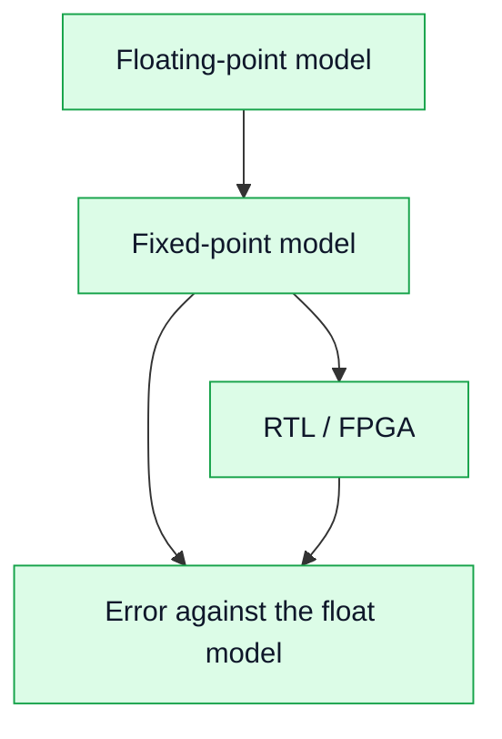

# 18. Fixed-Point Effects in DSP and FPGA

## Goal
Understand how a limited word length affects the signal.

A model in MATLAB or Python computes with 64-bit floating point. An FPGA computes with integers of a chosen width: the RTL-SDR's ADC has 8 bits, the AD9363 has 12, the course's FPGA datapaths use 16-bit Q1.15 (a sign bit and 15 fractional bits, values from −1 to just under +1). Every step from the model to the FPGA is a step from "exact" numbers to integers, and three effects appear.

## 1. Main effects

### Quantization
Rounding to the nearest integer step adds an error of up to half a step to every sample. For a full-scale sine it behaves like noise, with a signal-to-quantization-noise ratio of about

```text
SQNR[dB] ≈ 6.02·N + 1.76
```

| Word length `N` | Example | SQNR |
|---:|---|---:|
| 8 bits | RTL-SDR ADC | 49.9 dB |
| 12 bits | AD9363 ADC | 74.0 dB |
| 16 bits | course Q1.15 datapath | 98.1 dB |

Each bit is worth 6 dB, but only if the signal uses the full scale: a signal 20 dB below full scale loses 20 dB of SQNR.

### Overflow
When a result does not fit the word, there are two behaviours:

- **wrap-around:** the default of integer arithmetic. `32767 + 1` in 16 bits gives `−32768`: the largest positive value becomes the most negative one, a huge error.
- **saturation:** the result is clamped to the largest representable value (`32767`). The error is small and predictable, at the cost of extra logic.

The course RTL saturates and counts every saturation event, so a test can prove that none happened (see the saturation counters of Lab 8.14).

### Scaling
Where the signal sits inside the word is a design choice. Too large, and filters, mixers and FFTs overflow; too small, and the quantization noise eats the dynamic range. The FFT of Lab 8.14 divides by 2 at every stage for exactly this reason.

## 2. Diagram



The course checks the chain in this order: the fixed-point model is compared with the float model (is the error acceptable?), then the RTL with the fixed-point model (bit for bit).

## 3. Where the course does this
- [Lab 4.1](/zynq-sdr-course/en/labs/lab-4-1-fixed-point-fir/) and [Lab 4.2](/zynq-sdr-course/en/labs/lab-4-2-fixed-point-digital-mixer/): a FIR filter and a mixer in fixed point;
- [Lab 4.3](/zynq-sdr-course/en/labs/lab-4-3-bpsk-fixed-point-chain/): a BPSK chain and its format table;
- [Lab 5.5](/zynq-sdr-course/en/labs/lab-5-5-float-fixed-rtl-comparison/): float, fixed-point and RTL side by side.

## 4. Review questions
1. How much SQNR does each extra bit add, and when is that not true?
2. What does `32767 + 1` give in 16-bit two's complement, and why is that worse than saturation?
3. Why does an FFT in an FPGA usually scale by 1/2 at each stage?

## 5. Engineering conclusion

Fixed point is the main source of errors on the way from a model to an FPGA, and also the most testable one: once the format is written down, the error can be predicted and checked.
