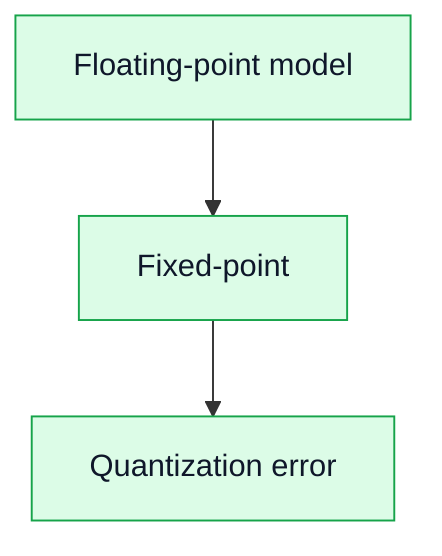

# 18. Fixed-point эффекты в DSP и FPGA

## Цель
Понять, как ограниченная разрядность влияет на сигнал.

## Основные эффекты

### Квантование
- ошибка округления;
- добавляет шум.

### Переполнение
- wrap-around;
- saturation.

### Масштабирование
- выбор коэффициентов влияет на динамический диапазон.

## Диаграмма

## Практический вывод

Fixed-point — главный источник ошибок при переходе от модели к FPGA.
