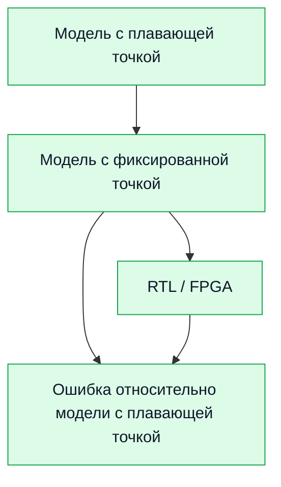

# 18. Эффекты фиксированной точки в DSP и FPGA

## Цель
Понять, как ограниченная разрядность влияет на сигнал.

Модель в MATLAB или Python считает в 64-битной плавающей точке. FPGA считает целыми числами выбранной ширины: у АЦП RTL-SDR 8 бит, у AD9363 — 12, тракты FPGA в курсе используют 16-битный формат Q1.15 (знаковый бит и 15 дробных бит, значения от −1 до чуть меньше +1). Каждый шаг от модели к FPGA — шаг от «точных» чисел к целым, и при этом проявляются три эффекта.

## 1. Основные эффекты

### Квантование
Округление до ближайшего целого шага добавляет к каждому отсчёту ошибку до половины шага. Для синусоиды полной шкалы она ведёт себя как шум, и отношение сигнал/шум квантования примерно равно

```text
SQNR[dB] ≈ 6.02·N + 1.76
```

| Разрядность `N` | Пример | SQNR |
|---:|---|---:|
| 8 бит | АЦП RTL-SDR | 49,9 дБ |
| 12 бит | АЦП AD9363 | 74,0 дБ |
| 16 бит | тракт курса Q1.15 | 98,1 дБ |

Каждый бит стоит 6 дБ, но только если сигнал занимает всю шкалу: сигнал на 20 дБ ниже полной шкалы теряет 20 дБ SQNR.

### Переполнение
Когда результат не помещается в слово, возможны два поведения:

- **перенос (wrap-around):** поведение целочисленной арифметики по умолчанию. `32767 + 1` в 16 битах даёт `−32768`: наибольшее положительное значение превращается в наибольшее по модулю отрицательное — огромная ошибка.
- **насыщение (saturation):** результат ограничивается наибольшим представимым значением (`32767`). Ошибка мала и предсказуема ценой дополнительной логики.

RTL курса использует насыщение и считает каждое событие насыщения, поэтому тест может доказать, что их не было (см. счётчики насыщения в Лабораторной 8.14).

### Масштабирование
Где сигнал располагается внутри слова — проектное решение. Слишком крупно — фильтры, смесители и FFT переполняются; слишком мелко — шум квантования съедает динамический диапазон. Именно поэтому FFT в Лабораторной 8.14 делит на 2 на каждой ступени.

## 2. Диаграмма


```mermaid
flowchart TB
    classDef dsp fill:#DCFCE7,color:#0F172A,stroke:#16A34A;

    FLOAT["Модель с плавающей точкой"]:::dsp
    FIXED["Модель с фиксированной точкой"]:::dsp
    RTL["RTL / FPGA"]:::dsp
    ERR["Ошибка относительно модели с плавающей точкой"]:::dsp

    FLOAT --> FIXED --> RTL
    FIXED --> ERR
    RTL --> ERR
```

Курс проверяет цепочку в таком порядке: модель с фиксированной точкой сравнивается с моделью с плавающей (приемлема ли ошибка?), затем RTL — с моделью с фиксированной точкой (бит в бит).

## 3. Где это делается в курсе
- [Лабораторная 4.1](/zynq-sdr-course/ru/labs/lab-4-1-fixed-point-fir/) и [Лабораторная 4.2](/zynq-sdr-course/ru/labs/lab-4-2-fixed-point-digital-mixer/): FIR-фильтр и смеситель в фиксированной точке;
- [Лабораторная 4.3](/zynq-sdr-course/ru/labs/lab-4-3-bpsk-fixed-point-chain/): BPSK-цепочка и её таблица форматов;
- [Лабораторная 5.5](/zynq-sdr-course/ru/labs/lab-5-5-float-fixed-rtl-comparison/): плавающая точка, фиксированная точка и RTL рядом.

## 4. Контрольные вопросы
1. Сколько SQNR добавляет каждый дополнительный бит и когда это неверно?
2. Что даёт `32767 + 1` в 16-битном дополнительном коде и почему это хуже насыщения?
3. Почему FFT в FPGA обычно масштабирует на 1/2 на каждой ступени?

## 5. Инженерный вывод

Фиксированная точка — главный источник ошибок на пути от модели к FPGA и одновременно самый проверяемый: когда формат записан, ошибку можно предсказать и проверить.
