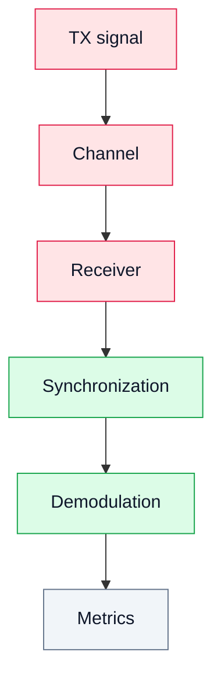

# 19. Laboratory Work 6. The Complete SDR Chain (end to end)

## Goal
Combine the elements of the course into one experiment: a digital signal is formed, passes through a channel, is received, synchronized and demodulated, and the result is judged by numbers.

## 1. The complete chain

```text
TX → Channel → RX → Sync → Demod → Metrics
```

## 2. Diagram



## 3. Tasks

1. Form a signal (QPSK).
2. Pass it through the chain.
3. Receive the signal.
4. Synchronize.
5. Demodulate.
6. Evaluate BER and EVM.

## 4. Three levels of the same experiment
The course builds this chain three times, each time closer to the hardware:

| Level | What the channel is | Where |
|---|---|---|
| model | software impairments: noise, CFO, timing offset | [Lab 8.8](/zynq-sdr-course/en/labs/lab-8-8-qpsk-modem-impairments/), [Lab 8.4](/zynq-sdr-course/en/labs/lab-8-4-end-to-end-sync-chain/) |
| RTL | simulated datapath of the FPGA receiver | [Lab 8.14](/zynq-sdr-course/en/labs/lab-8-14-ofdm-rtl-chain/) (OFDM), [Project 12.1](/zynq-sdr-course/en/labs/project-12-1-qpsk-modem-final-project/) |
| hardware | the Zynq board, digital loopback or a radio link | [Lab 11.27](/zynq-sdr-course/en/labs/lab-11-27-runtime-qpsk-digital-loopback/), [Lab 11.28](/zynq-sdr-course/en/labs/lab-11-28-rtl-sdr-ota-qpsk/) |

Start at the model level; every level that follows reuses the same metrics, so the numbers stay comparable.

## 5. What the report should include
- the signal parameters (modulation, symbol rate, samples per symbol);
- the channel and its impairments;
- the constellation after synchronization;
- EVM and BER with the number of compared bits;
- what limited the result.

## 6. Result

The student gets a complete picture of an SDR system and of the measurements that show whether it works.
