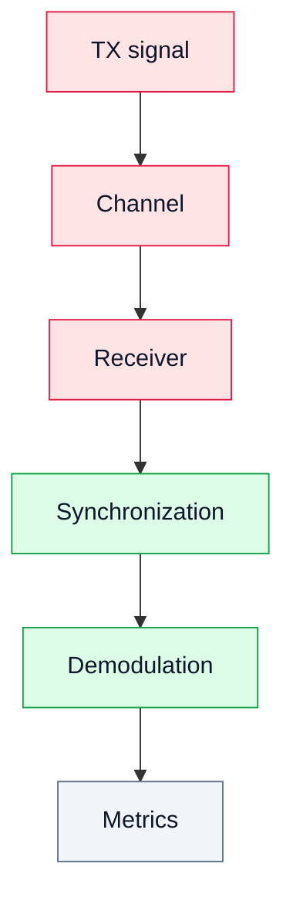

# 19. Лабораторная работа 6. Полный SDR-тракт (end-to-end)

## Цель
Объединить все элементы курса в один эксперимент.

## Полная цепочка

```text
TX → Channel → RX → Sync → Demod → Metrics
```

## Диаграмма



## Задачи

1. Сформировать сигнал (QPSK).
2. Передать через тракт.
3. Принять сигнал.
4. Выполнить синхронизацию.
5. Демодулировать.
6. Оценить BER и EVM.

## Результат

Студент получает полное понимание SDR-системы.
