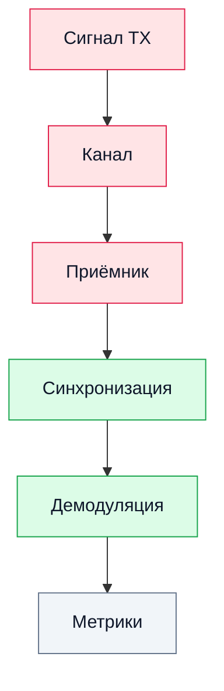

# 19. Лабораторная работа 6. Полный SDR-тракт (end-to-end)

## Цель
Объединить элементы курса в один эксперимент: цифровой сигнал формируется, проходит через канал, принимается, синхронизируется и демодулируется, а результат оценивается числами.

## 1. Полная цепочка

```text
TX → Channel → RX → Sync → Demod → Metrics
```

## 2. Диаграмма


```mermaid
flowchart TB
    classDef dsp fill:#DCFCE7,color:#0F172A,stroke:#16A34A;
    classDef rf fill:#FFE4E6,color:#0F172A,stroke:#E11D48;
    classDef metric fill:#F1F5F9,color:#0F172A,stroke:#64748B;

    TX["Сигнал TX"]:::rf
    CH["Канал"]:::rf
    RX["Приёмник"]:::rf
    SYNC["Синхронизация"]:::dsp
    DEMOD["Демодуляция"]:::dsp
    METRICS["Метрики"]:::metric

    TX --> CH --> RX --> SYNC --> DEMOD --> METRICS
```

## 3. Задачи

1. Сформировать сигнал (QPSK).
2. Передать его через тракт.
3. Принять сигнал.
4. Выполнить синхронизацию.
5. Демодулировать.
6. Оценить BER и EVM.

## 4. Три уровня одного эксперимента
Курс строит эту цепочку трижды, каждый раз ближе к аппаратуре:

| Уровень | Что является каналом | Где |
|---|---|---|
| модель | программные искажения: шум, CFO, сдвиг тайминга | [Лабораторная 8.8](/zynq-sdr-course/ru/labs/lab-8-8-qpsk-modem-impairments/), [Лабораторная 8.4](/zynq-sdr-course/ru/labs/lab-8-4-end-to-end-sync-chain/) |
| RTL | симулируемый тракт приёмника в FPGA | [Лабораторная 8.14](/zynq-sdr-course/ru/labs/lab-8-14-ofdm-rtl-chain/) (OFDM), [Проект 12.1](/zynq-sdr-course/ru/labs/project-12-1-qpsk-modem-final-project/) |
| аппаратура | плата Zynq, цифровой loopback или радиоканал | [Лабораторная 11.27](/zynq-sdr-course/ru/labs/lab-11-27-runtime-qpsk-digital-loopback/), [Лабораторная 11.28](/zynq-sdr-course/ru/labs/lab-11-28-rtl-sdr-ota-qpsk/) |

Начинайте с уровня модели; каждый следующий уровень использует те же метрики, поэтому числа остаются сравнимыми.

## 5. Что должно быть в отчёте
- параметры сигнала (модуляция, символьная скорость, отсчётов на символ);
- канал и его искажения;
- созвездие после синхронизации;
- EVM и BER с числом сравнённых бит;
- что ограничило результат.

## 6. Результат

Студент получает целостное представление об SDR-системе и об измерениях, которые показывают, работает ли она.
