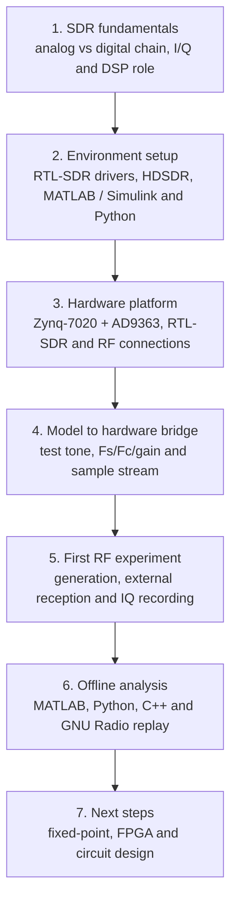

# Block 1. Introduction to SDR, Tools, and First Signal Reception

## Engineering route of the block

## Hardware setup photos

### RTL-SDR V3 Pro

### Xilinx Zynq-7020 + ADRV module

## Core learning chain

**Mathematical model → fixed-point → sample stream → FPGA/SoC → physical signal → external reception → IQ recording → offline analysis**

## Practical outcome

After completing the block, the student can execute the full SDR loop:

**generation → transmission → reception → recording → analysis**
