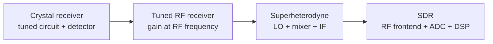
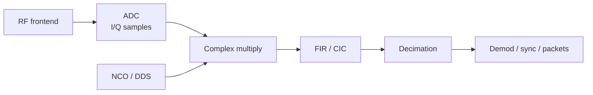
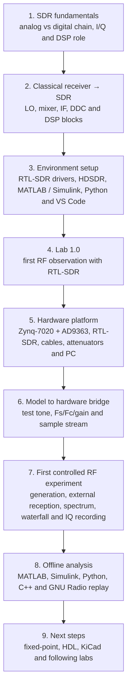

# Block 1. Introduction to SDR, Tools, and First Signal Reception

## Description

The first block introduces the hardware and software base of the SDR course and guides the student through the first practical RF experiments.

The main goals of the block are to:

- understand what SDR is;
- connect classical radio receiver ideas with the digital SDR chain;
- understand the route model → hardware → reception → recording → analysis;
- prepare the working environment;
- run the first passive RTL-SDR observation;
- run the first controlled test-tone experiment;
- get the first view of the circuit-design part of the course and the role of KiCad.

The block uses the following concept:

**The Zynq7020 + AD9363 SDR board generates a test signal, RTL-SDR receives it, HDSDR displays the spectrum, and the recorded IQ data are analyzed in MATLAB, Simulink, Python, C++, and GNU Radio.**

Before the controlled experiment with the SDR board, the student can complete **Lab 1.0 — First RF Observation with RTL-SDR**. It shows a real spectrum/waterfall view, creates the first IQ recording, and prepares the student for the engineering route of the course.

KiCad is also introduced as a tool for reading schematics, documenting educational connections, and preparing for later analog and digital circuit labs.

## From classical radio receivers to SDR

SDR is easier to understand not as a “radio USB stick”, but as a development of the classical receiver. In an analog receiver, many operations are performed by separate physical blocks: tuned circuit, local oscillator, mixer, intermediate-frequency filter, detector, AGC, and amplifiers. In SDR, many of these functions move into the digital domain and become DSP algorithms.

A simplified development path is:

The key engineering transition is that after the RF frontend and ADC, the signal is represented as a stream of samples. It is then processed by digital blocks: NCO, complex mixer, FIR/CIC filters, decimator, AGC, synchronization, demodulator, and packet-processing logic.

## Superheterodyne as an analog predecessor of DDC

A superheterodyne receiver translates the selected RF channel to an intermediate frequency using a local oscillator and a mixer. The IF filter then selects the channel bandwidth, and the detector extracts the useful signal.

In SDR, the same idea can be written as a digital chain:

This view immediately links introductory radio concepts with later course topics: digital mixing, DDC/DUC, FIR, CIC, fixed-point, HDL, and FPGA streaming architecture.

## Analog block → DSP/FPGA block

| Classical receiver block | Purpose | Digital counterpart in the course |
|---|---|---|
| Input tuned circuit / preselector | Coarse band selection and out-of-band rejection | RF frontend, frequency plan, anti-aliasing |
| Local oscillator | Reference for frequency translation | NCO / DDS |
| Mixer | Frequency translation | Complex multiplication, digital mixing, DDC/DUC |
| IF filter | Channel bandwidth selection | FIR, CIC, channel filter |
| AM/FM/SSB detector | Message extraction from the carrier | Digital demodulator |
| AGC | Level stabilization | Digital AGC, gain staging, overload protection |
| Squelch / noise gate | Suppression of weak or irrelevant channels | Level estimation, threshold logic, DSP filtering |
| Measurement instrument | Level and spectrum control | FFT, waterfall, IQ analysis, measurement report |

This table is used as a navigation map: each classical analog block later receives a digital implementation, a testbench, a fixed-point assessment, and, where possible, an HDL/FPGA route.

## Engineering route of the block

## Hardware setup photos

### RTL-SDR V3 Pro

RTL-SDR is used as the external receiver in the first practical labs.

### Xilinx Zynq-7020 + ADRV module

This photo shows the real SDR platform used in the practical part of the first block.

## Software stack

### Minimal starting set

- RTL-SDR driver;
- HDSDR;
- MATLAB / Simulink;
- Python;
- VS Code.

### Extended engineering set

- SDRSharp / SDR++ as additional tools for quick RF observation;
- GNU Radio;
- Vivado / Vitis;
- KiCad;
- C/C++ compiler;
- Fixed-Point Designer and HDL tools where needed.

## Topics of the first block

1. **Introduction to SDR**: Software Defined Radio, analog/digital boundary, I/Q representation, and the role of DSP.
2. **Classical receiver and SDR**: crystal receiver, superheterodyne, local oscillator, mixer, IF, and digital DDC.
3. **Environment setup**: minimal and extended software stack and workplace checklist.
4. **Course hardware setup**: Zynq7020, AD9363, RTL-SDR, RF connections, and level control.
5. **Model-to-board bridge**: from a Simulink tone to sample streams, hardware implementation, and external reception.
6. **KiCad introduction**: why circuit design matters even in an SDR course.
7. **Lab 1.0**: passive RF observation, spectrum/waterfall, and short IQ recording.
8. **Lab 1**: test-signal generation and reception, HDSDR observation, parameter capture, and IQ recording.
9. **IQ analysis in MATLAB**: file reading, time-domain waveform, spectrum, and peak-frequency estimation.
10. **IQ analysis in Simulink**: minimal visual analysis model.
11. **IQ analysis in Python**: scripted processing and measurement automation.
12. **IQ analysis in C++**: IQ storage format and performance-oriented analysis path.
13. **IQ analysis in GNU Radio**: simple visual flowgraph for time and spectrum replay.

## Core learning chain

**Classical receiver → SDR architecture → mathematical model → fixed-point → sample stream → FPGA/SoC → physical signal → external reception → IQ recording → offline analysis**

## Practical outcome

After completing the block, the student can execute the full SDR loop:

**observation → generation → transmission → reception → recording → analysis**

The student also understands how classical receiver concepts map to digital DSP/FPGA blocks used throughout the rest of the course.
