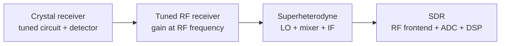
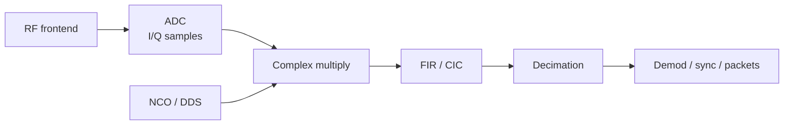
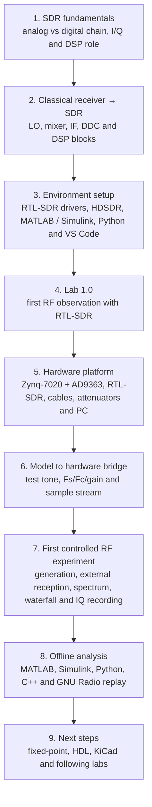

# Block 1. Introduction to SDR, Tools, and First Signal Reception

## Description

The first block introduces the hardware and software base of the SDR course and guides the student through the first practical RF experiments.

The main goals of the block are to:

- understand what SDR is;
- connect classical radio receiver ideas with the digital SDR chain;
- understand the route model → hardware → reception → recording → analysis;
- prepare the working environment;
- run the first passive RTL-SDR observation;
- run the first controlled test-tone experiment;
- get the first view of the circuit-design part of the course and the role of KiCad.

The block uses the following concept:

**The Zynq7020 + AD9363 SDR board generates a test signal, RTL-SDR receives it, HDSDR displays the spectrum, and the recorded IQ data are analyzed in MATLAB, Simulink, Python, C++, and GNU Radio.**

Before the controlled experiment with the SDR board, the student can complete **Lab 1.0 — First RF Observation with RTL-SDR**. It shows a real spectrum/waterfall view, creates the first IQ recording, and prepares the student for the engineering route of the course.

KiCad is also introduced as a tool for reading schematics, documenting educational connections, and preparing for later analog and digital circuit labs.

## From classical radio receivers to SDR

SDR is easier to understand not as a “radio USB stick”, but as a development of the classical receiver. In an analog receiver, many operations are performed by separate physical blocks: tuned circuit, local oscillator, mixer, intermediate-frequency filter, detector, AGC, and amplifiers. In SDR, many of these functions move into the digital domain and become DSP algorithms.

A simplified development path is:

```mermaid
flowchart LR
    DET["Crystal receiver<br/>tuned circuit + detector"]
    TRF["Tuned RF receiver<br/>gain at RF frequency"]
    SUPER["Superheterodyne<br/>LO + mixer + IF"]
    SDR["SDR<br/>RF frontend + ADC + DSP"]

    DET --> TRF --> SUPER --> SDR
```

The key engineering transition is that after the RF frontend and ADC, the signal is represented as a stream of samples. It is then processed by digital blocks: NCO, complex mixer, FIR/CIC filters, decimator, AGC, synchronization, demodulator, and packet-processing logic.

## Superheterodyne as an analog predecessor of DDC

A superheterodyne receiver translates the selected RF channel to an intermediate frequency using a local oscillator and a mixer. The IF filter then selects the channel bandwidth, and the detector extracts the useful signal.

In SDR, the same idea can be written as a digital chain:

```mermaid
flowchart LR
    RF["RF frontend"]
    ADC["ADC<br/>I/Q samples"]
    NCO["NCO / DDS"]
    MIX["Complex multiply"]
    FILT["FIR / CIC"]
    DEC["Decimation"]
    DEMOD["Demod / sync / packets"]

    RF --> ADC --> MIX --> FILT --> DEC --> DEMOD
    NCO --> MIX
```

This view immediately links introductory radio concepts with later course topics: digital mixing, DDC/DUC, FIR, CIC, fixed-point, HDL, and FPGA streaming architecture.

## Analog block → DSP/FPGA block

| Classical receiver block | Purpose | Digital counterpart in the course |
|---|---|---|
| Input tuned circuit / preselector | Coarse band selection and out-of-band rejection | RF frontend, frequency plan, anti-aliasing |
| Local oscillator | Reference for frequency translation | NCO / DDS |
| Mixer | Frequency translation | Complex multiplication, digital mixing, DDC/DUC |
| IF filter | Channel bandwidth selection | FIR, CIC, channel filter |
| AM/FM/SSB detector | Message extraction from the carrier | Digital demodulator |
| AGC | Level stabilization | Digital AGC, gain staging, overload protection |
| Squelch / noise gate | Suppression of weak or irrelevant channels | Level estimation, threshold logic, DSP filtering |
| Measurement instrument | Level and spectrum control | FFT, waterfall, IQ analysis, measurement report |

This table is used as a navigation map: each classical analog block later receives a digital implementation, a testbench, a fixed-point assessment, and, where possible, an HDL/FPGA route.

## Engineering route of the block

```mermaid
flowchart TB
    THEORY["1. SDR fundamentals<br/>analog vs digital chain, I/Q and DSP role"]
    CLASSIC["2. Classical receiver → SDR<br/>LO, mixer, IF, DDC and DSP blocks"]
    SETUP["3. Environment setup<br/>RTL-SDR drivers, HDSDR, MATLAB / Simulink, Python and VS Code"]
    RTL["4. Lab 1.0<br/>first RF observation with RTL-SDR"]
    HARDWARE["5. Hardware platform<br/>Zynq-7020 + AD9363, RTL-SDR, cables, attenuators and PC"]
    MODEL["6. Model to hardware bridge<br/>test tone, Fs/Fc/gain and sample stream"]
    LAB["7. First controlled RF experiment<br/>generation, external reception, spectrum, waterfall and IQ recording"]
    ANALYSIS["8. Offline analysis<br/>MATLAB, Simulink, Python, C++ and GNU Radio replay"]
    NEXT["9. Next steps<br/>fixed-point, HDL, KiCad and following labs"]

    THEORY --> CLASSIC --> SETUP --> RTL --> HARDWARE --> MODEL --> LAB --> ANALYSIS --> NEXT
```

## Hardware setup photos

### RTL-SDR V3 Pro

RTL-SDR is used as the external receiver in the first practical labs.

### Xilinx Zynq-7020 + ADRV module

This photo shows the real SDR platform used in the practical part of the first block.

## Software stack

### Minimal starting set

- Python with the course dependencies (`python tools/tasks.py install`);
- RTL-SDR driver;
- a spectrum viewer: HDSDR, SDR#, SDR++ or GQRX;
- VS Code.

MATLAB / Simulink are an optional parallel route; every lab runs in Python.

### Extended engineering set

- SDRSharp / SDR++ as additional tools for quick RF observation;
- GNU Radio;
- Vivado / Vitis;
- KiCad;
- C/C++ compiler;
- Fixed-Point Designer and HDL tools where needed.

## Topics of the first block

The practical entry points are [Lab 1.0](/zynq-sdr-course/en/labs/lab-1-0-first-rtl-sdr-observation/) (passive observation with RTL-SDR only) and [Lab 1.1](/zynq-sdr-course/en/labs/lab-1-1-controlled-zynq-tone-rtl-sdr/) (the board's tone, captured and scored by a script). The pages below are the theory and the overview labs of the block; the overview labs 2-6 each point to the runnable labs that implement them later in the course.

| Page | Topic |
|---|---|
| 01 | [Introduction to SDR](/zynq-sdr-course/en/block01/01-theory-intro/) |
| 02 | [Preparing the Software Environment](/zynq-sdr-course/en/block01/02-software-setup/) |
| 03 | [Hardware Platform of the Course](/zynq-sdr-course/en/block01/03-hardware-overview/) |
| 04 | [Bridge from Model to Hardware](/zynq-sdr-course/en/block01/04-model-to-hardware-bridge/) |
| 04 | [Bridge: Simulink → FPGA → RF Path](/zynq-sdr-course/en/block01/04-model-to-fpga-pipeline/) |
| 05 | [Introduction to KiCad](/zynq-sdr-course/en/block01/05-kicad-intro/) |
| 05 | [DSP Chain in FPGA](/zynq-sdr-course/en/block01/05-fpga-dsp-chain/) |
| 06 | [Laboratory Work 1. Transmission and Reception of a Test Tone](/zynq-sdr-course/en/block01/06-lab1-tone-tx-rx/) |
| 06 | [RF Measurements in SDR](/zynq-sdr-course/en/block01/06-rf-measurements/) |
| 07 | [Analysis of the Recorded Signal in MATLAB](/zynq-sdr-course/en/block01/07-iq-analysis-matlab/) |
| 08 | [Analysis of the Recorded Signal in Simulink](/zynq-sdr-course/en/block01/08-iq-analysis-simulink/) |
| 09 | [Analysis of the Recorded Signal in Python](/zynq-sdr-course/en/block01/09-iq-analysis-python/) |
| 10 | [Analysis of the Recorded Signal in C++](/zynq-sdr-course/en/block01/10-iq-analysis-cpp/) |
| 11 | [Analysis of the Recorded Signal in GNU Radio](/zynq-sdr-course/en/block01/11-iq-analysis-gnuradio/) |
| 12 | [Laboratory Work 2. AM/FM Modulation and Demodulation](/zynq-sdr-course/en/block01/12-lab2-am-fm-modulation/) |
| 13 | [Laboratory Work 3. Digital Modulation (BPSK/QPSK)](/zynq-sdr-course/en/block01/13-lab3-digital-modulation/) |
| 14 | [Laboratory Work 4. Synchronization in an SDR Receiver](/zynq-sdr-course/en/block01/14-lab4-synchronization/) |
| 15 | [Signal Quality Metrics: FFT, SNR, EVM and BER](/zynq-sdr-course/en/block01/15-signal-metrics/) |
| 16 | [FFT and Spectral Analysis](/zynq-sdr-course/en/block01/16-fft-spectral-analysis/) |
| 16 | [Laboratory Work 5. SDR Impairments: noise, CFO, mismatch and clipping](/zynq-sdr-course/en/block01/16-lab5-impairments/) |
| 17 | [Link Budget in SDR Systems](/zynq-sdr-course/en/block01/17-link-budget/) |
| 18 | [Fixed-Point Effects in DSP and FPGA](/zynq-sdr-course/en/block01/18-fixed-point-effects/) |
| 19 | [Laboratory Work 6. The Complete SDR Chain (end to end)](/zynq-sdr-course/en/block01/19-lab6-end-to-end/) |

## Core learning chain

**Classical receiver → SDR architecture → mathematical model → fixed-point → sample stream → FPGA/SoC → physical signal → external reception → IQ recording → offline analysis**

## Practical outcome

After completing the block, the student can execute the full SDR loop:

**observation → generation → transmission → reception → recording → analysis**

The student also understands how classical receiver concepts map to digital DSP/FPGA blocks used throughout the rest of the course.
