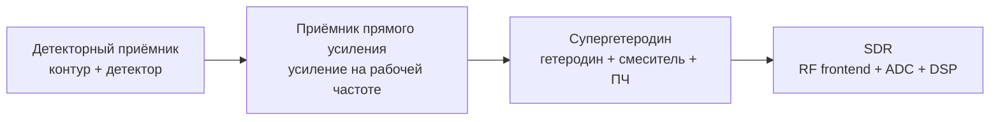
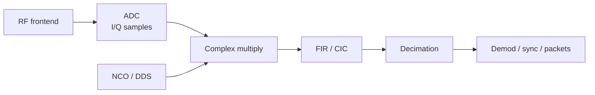
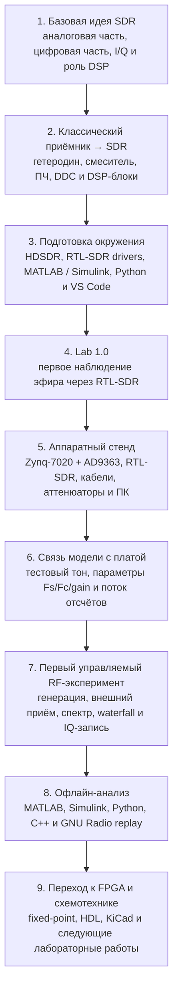

# Блок 1. Введение в SDR, инструменты и первый приём сигнала

## Описание
Первый блок курса знакомит с аппаратной и программной базой SDR-проекта и проводит через первую практическую лабораторную работу.

Основная идея блока:
- понять, что такое SDR;
- увидеть связь между классическим радиоприёмником и цифровым SDR-трактом;
- познакомиться с трактом «модель → железо → приём → запись → анализ»;
- подготовить рабочее окружение;
- выполнить первый эксперимент с тестовым тоновым сигналом;
- получить первое представление о схемотехнической части курса и роли KiCad.

В этом блоке используется следующая концепция:
**SDR-плата на Zynq7020 + AD9363 формирует тестовый сигнал, RTL-SDR принимает его, HDSDR отображает спектр, а записанные IQ-данные анализируются в MATLAB, Simulink, Python, C++ и GNU Radio.**

Перед управляемым экспериментом с собственной SDR-платой студент может выполнить вводную лабораторную **Lab 1.0 — первое наблюдение эфира через RTL-SDR**. Она показывает реальный spectrum/waterfall, даёт первую IQ-запись и подготавливает к дальнейшему инженерному маршруту.

Дополнительно в блок вводится **KiCad** как инструмент для чтения схем, оформления учебных электрических соединений и подготовки к дальнейшим лабораторным работам по аналоговой и цифровой схемотехнике.

## От классического радиоприёмника к SDR

SDR удобно объяснять не как «радио в USB-флешке», а как развитие классического приёмника. В аналоговом тракте большая часть обработки выполняется отдельными физическими узлами: контуром, гетеродином, смесителем, фильтром промежуточной частоты, детектором, АРУ и усилителями. В SDR часть этих функций переносится в цифровую область и реализуется как DSP-алгоритмы.

Упрощённая цепочка развития выглядит так:

Ключевой инженерный переход состоит в том, что в SDR после RF frontend и АЦП сигнал представлен в виде потока отсчётов. Дальше с ним работают цифровые блоки: NCO, комплексный смеситель, FIR/CIC-фильтры, decimator, AGC, синхронизация, демодулятор и пакетная обработка.

## Супергетеродин как аналоговый предок DDC

Супергетеродин переносит выбранный радиоканал на промежуточную частоту с помощью гетеродина и смесителя. Затем фильтр ПЧ выделяет нужную полосу, а детектор извлекает полезный сигнал.

В SDR ту же идею можно записать в цифровом виде:

Такой взгляд сразу связывает вводную радиотехнику с темами курса: digital mixing, DDC/DUC, FIR, CIC, fixed-point, HDL и FPGA-потоковая архитектура.

## Аналоговый блок → DSP/FPGA-блок

| Классический радиоблок | Назначение | Цифровой аналог в курсе |
|---|---|---|
| Входной контур / преселектор | Грубый выбор диапазона и подавление внеполосных сигналов | RF frontend, частотный план, антиалиасинг |
| Гетеродин | Опорная частота для переноса спектра | NCO / DDS |
| Смеситель | Перенос частоты | Комплексное умножение, digital mixing, DDC/DUC |
| Фильтр ПЧ | Выделение полосы канала | FIR, CIC, channel filter |
| Детектор AM/FM/SSB | Извлечение сообщения из несущей | Цифровой демодулятор |
| АРУ | Стабилизация уровня | Digital AGC, gain staging, защита от перегрузки |
| Шумоподавитель / squelch | Подавление слабого или ненужного канала | Оценка уровня, пороговая логика, DSP-фильтрация |
| Измерительный прибор | Контроль уровня и спектра | FFT, waterfall, IQ-анализ, отчёт измерений |

Эта таблица используется как навигационная карта: каждый аналоговый блок позднее получает цифровую реализацию, тестбенч, fixed-point-оценку и, где это возможно, HDL/FPGA-маршрут.

## Инженерный маршрут блока

## Что проходит студент в этом блоке
Блок построен как первый законченный инженерный маршрут:

1. понять базовую идею SDR и границу между аналоговой и цифровой частями тракта;
2. увидеть, как классический супергетеродин связан с DDC;
3. собрать минимальное рабочее окружение;
4. выполнить вводное наблюдение эфира через RTL-SDR;
5. разобраться в составе учебного стенда;
6. увидеть, как модель сигнала связана с железом;
7. выполнить первую лабораторную работу с тестовым тоном;
8. записать IQ-данные;
9. сравнить один и тот же сигнал в нескольких инструментах анализа.

## Цели блока
После изучения блока студент должен:
- понимать базовую архитектуру SDR;
- различать роли аналоговой и цифровой частей радиотракта;
- объяснять связь между гетеродином, смесителем, ПЧ-фильтром и цифровым DDC;
- ориентироваться в составе учебного стенда;
- установить и запустить основное ПО;
- принять сигнал на RTL-SDR;
- принять тестовый сигнал на RTL-SDR;
- записать IQ-данные;
- выполнить первичный анализ сигнала;
- понимать, как Simulink-модель связана с реализацией на плате;
- понимать, зачем в курсе нужен KiCad.

## Аппаратная база
В первом блоке используется следующий состав стенда:

- SDR-плата на базе **Zynq7020 + AD9363**;
- внешний приёмник **RTL-SDR**;
- персональный компьютер как среда моделирования, наблюдения и анализа;
- кабели, антенны, переходники и при необходимости аттенюаторы;
- базовый набор схемотехнических материалов для следующих лабораторных работ.

### Почему именно такая конфигурация
- **Zynq7020 + AD9363** даёт реальную платформу, на которой можно пройти путь от цифровой модели до физического сигнала.
- **RTL-SDR** позволяет быстро и наглядно увидеть результат эксперимента внешним приёмником.
- **HDSDR** закрывает задачу первичного наблюдения спектра и водопада без лишней сложности.
- **MATLAB, Simulink, Python, C++, GNU Radio** показывают, что один и тот же записанный сигнал можно исследовать в разных инженерных средах.

## Иллюстрации стенда

### RTL-SDR V3 Pro

RTL-SDR используется как внешний приёмник в первой практической лабораторной работе.

### Плата Xilinx Zynq-7020 + модуль ADRV

Эта фотография показывает реальную SDR-платформу на уровне платы, которая используется в практической части первого блока.

## Программный стек блока
### Минимальный набор для старта
- драйвер **RTL-SDR**;
- **HDSDR**;
- **MATLAB / Simulink**;
- **Python**;
- **VS Code**.

### Расширенный инженерный набор
- **SDRSharp / SDR++** как дополнительные программы для быстрого наблюдения эфира;
- **GNU Radio**;
- **Vivado / Vitis**;
- **KiCad**;
- компилятор **C/C++**;
- при необходимости **Fixed-Point Designer** и инструменты HDL-маршрута.

## Темы первого блока
Блок собран из связанных разделов:

1. **Введение в SDR**: что такое Software Defined Radio, где проходит граница между аналоговой и цифровой частями, зачем нужны I/Q-представление и DSP.
2. **Классический приёмник и SDR**: детекторный приёмник, супергетеродин, гетеродин, смеситель, ПЧ и цифровой DDC.
3. **Подготовка программного окружения**: минимальный и расширенный набор ПО, а также проверочный чек-лист рабочего места.
4. **Аппаратная база курса**: состав стенда, роли Zynq7020, AD9363 и RTL-SDR, варианты соединения и контроль уровней.
5. **Мостик от модели к плате**: путь от тона в Simulink к потоку отсчётов, аппаратной реализации и внешнему приёму.
6. **Введение в KiCad**: зачем схемотехника нужна даже в SDR-курсе и как связаны схема, сборка и измерение.
7. **Lab 1.0**: первое пассивное наблюдение эфира, spectrum/waterfall и короткая IQ-запись.
8. **Лабораторная работа 1**: генерация и приём тестового сигнала, наблюдение в HDSDR, фиксация параметров и запись IQ.
9. **Анализ IQ в MATLAB**: чтение файла, временная форма, спектр и оценка частоты пика.
10. **Анализ IQ в Simulink**: сборка минимальной модели визуального анализа.
11. **Анализ IQ в Python**: скриптовая обработка и автоматизация измерений.
12. **Анализ IQ в C++**: понимание формата хранения IQ и производительного пути анализа.
13. **Анализ IQ в GNU Radio**: визуальная сборка простого flowgraph для времени и спектра.

## Первая лабораторная работа
Первый управляемый эксперимент построен вокруг **тестового тона**. Это простой и воспроизводимый сигнал, который позволяет проверить весь тракт без лишней алгоритмической сложности.

По завершении лабораторной работы студент получает:

- первый реально принятый сигнал курса;
- подтверждение работы тракта по спектру и водопаду;
- набор параметров эксперимента;
- IQ-запись для дальнейшего анализа;
- понимание полного минимального цикла:
  **генерация → передача → приём → наблюдение → запись → анализ**.

## Роль KiCad в первом блоке
KiCad используется без перегрузки деталями, но с правильным инженерным акцентом: чтение схем, понимание соединений и подготовка к следующим работам по аналоговой и цифровой схемотехнике.

## Практический результат блока
После прохождения первого блока студент не просто читает теорию, а получает конкретный инженерный результат: умеет собрать минимальную рабочую среду, выполнить первое наблюдение эфира, выполнить первый воспроизводимый эксперимент, записать IQ-данные и связать модель, плату, приёмник и анализ.

## Ключевая учебная цепочка
**Классический приёмник → SDR-архитектура → математическая модель → фиксированная точка → поток отсчётов → FPGA/SoC → физический сигнал → внешний приём → запись IQ → офлайн-анализ**

## Почему этот блок важен
Первый блок задаёт правильную инженерную оптику для всего курса: один и тот же сигнал должен быть понятен в модели, на плате, во внешнем приёмнике, в записанном файле и в электрической схеме, которая поддерживает эксперимент.

## Следующий шаг
После завершения этого блока можно переходить к формированию сигнала в Simulink, fixed-point, HDL/FPGA-реализации и схемотехническим работам в KiCad.
