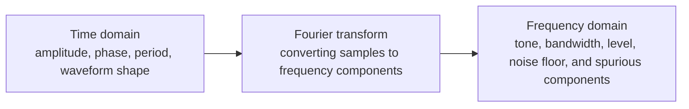

# 01. Signal in time and frequency

## Purpose

This section connects physical signal observation to two engineering
representations: the time-domain waveform and the spectrum.

## Key idea

The same signal can be viewed as:

- a sequence of time-domain samples;
- a set of frequency components;
- a physical RF signal after up-conversion to a carrier;
- a baseband / IQ representation after reception.

## The tone as a first reference

A test tone is convenient for a first analysis because it is expected to produce
exactly one dominant peak in the spectrum. If the peak appears at the wrong
frequency, the problem is usually in the frequency axis, sample rate, center
frequency, or a misconfigured receive chain.

## Engineering questions

| Question | Why it matters |
|---|---|
| Where is the peak? | Verify frequency and frequency axis calibration |
| What is the noise floor? | Assess reception quality |
| Are there spurious peaks? | Check DDS, mixer, RF gain, and overload |
| Is there a DC spike? | Check receiver and baseband processing |

## Mini exercise

1. Generate a sine wave with a known frequency.
2. Plot the time-domain waveform.
3. Compute and plot the FFT.
4. Verify that the peak frequency matches the expected value.
5. Record `Fs`, `N`, FFT resolution, and the measured peak frequency.
