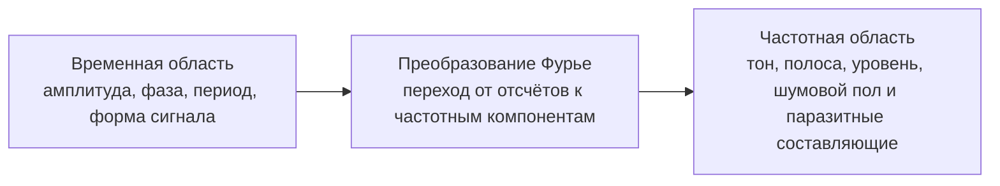

# 01. Сигнал во времени и частоте

## Назначение

Этот раздел связывает физическое наблюдение сигнала с двумя инженерными представлениями: временной формой и спектром.

## Что важно понять

Один и тот же сигнал можно рассматривать как:

- последовательность отсчётов во времени;
- набор частотных составляющих;
- физический RF-сигнал после переноса на несущую;
- baseband/IQ-представление после приёма.

## Тон как первый эталон

Тестовый тон удобен для первого анализа, потому что у него ожидается один доминирующий пик в спектре. Если пик находится не там, где ожидалось, проблема обычно связана с частотной осью, sample rate, center frequency или ошибкой настройки тракта.

## Инженерные вопросы

| Вопрос | Почему важен |
|---|---|
| Где расположен пик? | Проверка частоты и частотной оси |
| Каков уровень шума? | Оценка качества приёма |
| Есть ли паразитные пики? | Проверка DDS, микшера, RF gain и перегруза |
| Есть ли DC spike? | Проверка приёмника и обработки baseband |

## Мини-задание

1. Сгенерировать синус с известной частотой.
2. Построить временную форму.
3. Построить FFT.
4. Проверить, совпадает ли частота пика с ожидаемой.
5. Записать `Fs`, `N`, разрешение FFT и найденную частоту.
