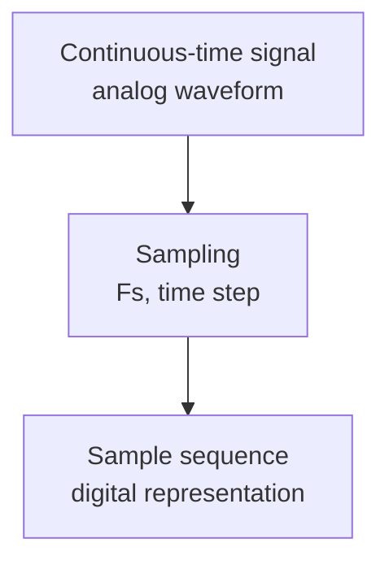
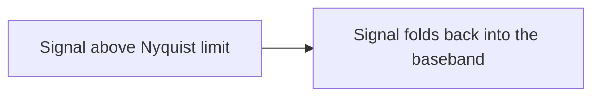

# 02. Sampling and the Nyquist theorem

## Core idea

Sampling converts a continuous-time signal into a sequence of discrete samples.
The key parameter is the sample rate `Fs`.



## Nyquist theorem

For correct signal reconstruction, the sample rate must satisfy:

```text
Fs ≥ 2 × Fmax
```

where `Fmax` is the highest frequency component present in the signal.

## Aliasing

When the condition is violated, aliasing occurs — spectral overlap caused by
undersampling.



## Engineering consequences

- peak appears at the wrong frequency;
- mirrored (aliased) spectra appear;
- the original signal cannot be recovered.

## Mini lab

1. Generate a signal above `Fs/2`.
2. Compute and plot the FFT.
3. Locate the aliased peak.
4. Compare with the predicted alias frequency `f_alias = |f_signal − Fs|`.
