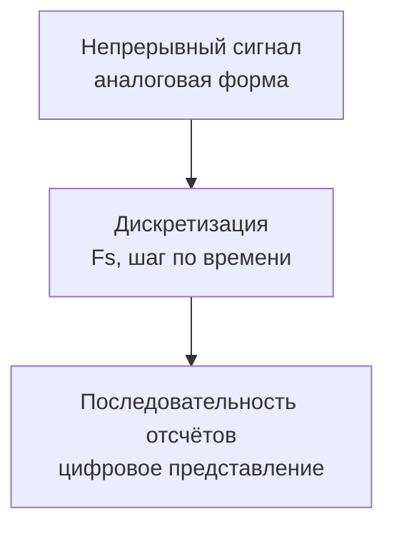

# 02. Дискретизация и теорема Найквиста

## Основная идея

Дискретизация переводит непрерывный сигнал в последовательность отсчётов. Ключевой параметр — частота дискретизации `Fs`.



## Теорема Найквиста

Для корректного восстановления сигнала необходимо:

```text
Fs ≥ 2 * Fmax
```

где `Fmax` — максимальная частота в сигнале.

## Aliasing

Если условие не выполнено, возникает aliasing — наложение спектров.


## Инженерные последствия

- неверная частота пика;
- зеркальные спектры;
- невозможность восстановить исходный сигнал.

## Мини-лабораторная

1. Сгенерировать сигнал выше `Fs/2`.
2. Построить FFT.
3. Найти, где появился пик.
4. Сравнить с ожидаемой alias-частотой.
